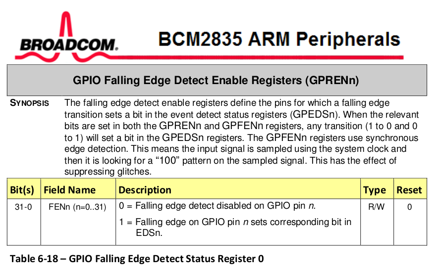
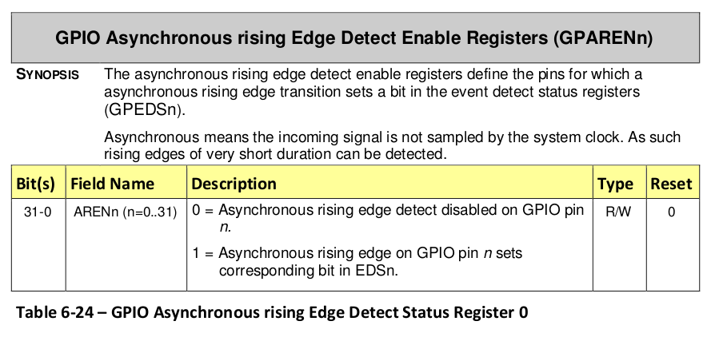
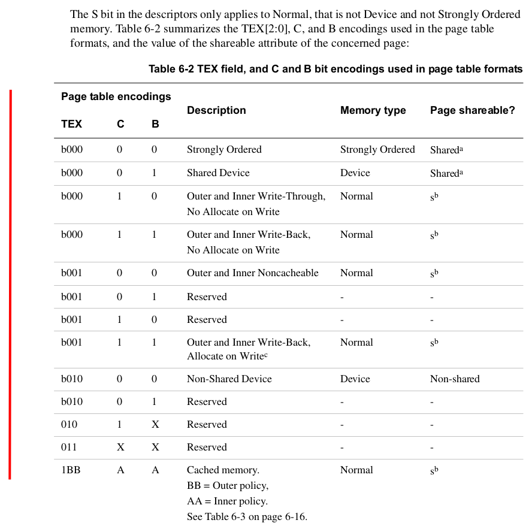
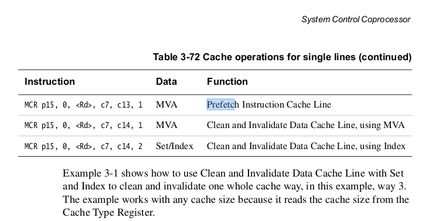

## Making device interrupts fast

This is a fun lab: you'll make GPIO interrupts as fast as possible.
The lab goes from about 3300 cycles down to 98 --- roughly a 33x speedup.
If you beat the final staff numbers by a non-noise amount I'll give you
$100 :).

Why do we want fast interrupts?
  1. The more we can do per second.  Throughput is money!
  2. The faster our response can be.  Latency is money!
  3. The more other work we can get done.
  4. The less chance (ideally 0) that we lose an interrupt.  ("Why?")
  5. The better timing accuracy we can get.  Accurate timing can be the
     difference between correct and broken.

     Examples of why accuracy good: running time-based digital protocols
     fast and for measuring what is going on (e.g., building a logic
     analyzer: later lab!).

     Why fast = accuracy: the faster the interrupt handler is, the less
     stuff does.  In general, each thing it does is a coin toss that can
     take a varying amount of time (either directly or by conflicting with
     something else).  The less tosses, the less variance (accuracy).
     You don't have to believe me: you'll see variance drop as you tune
     the code.

Two favorite things about the lab: 
  1. Optimizing tends to produce fun flow states.  When tuning my version
     I was staying up until 3am and waking up thinking about hacks to cut
     cycles for days in a row.  When you get up to my age you'll realize
     how rare such days are :).

  2. The starter code is small + and you've seen it before so there's
     not alot to worry about besides your own ideas and hardware features
     / implications.


#### Starter code: `code/gpio-int.c` and `code/interrupt-asm.S`

The starter code measures how long it takes to handle a GPIO generated
interrupt.  There are two files:
  - `code/gpio-int.c`: C code that sets up interrupts on rising and falling
    edges of a single GPIO pin, and then uses a simple loop to trigger
    them by alternatively writing 1 and 0 and measure the overhead.

  - `code/interrupts-asm.S`: assembly code to define the interrupt/exception 
    table and forward interrupts to C code.

The code is simple but slow.  Your job is to speed it up as much
as possible.  The code is roughly the same as examples you've seen in
140e's device interrupt lab (lab 8) and 240lx's IR lab (lab 3).


#### Checkoff

The rest of the README discusses the different tricks I did and the
speedups I got.   You should implement each one and see that you got
roughly the same speedups.  Many hacks exploit previous topics we've
covered so serve both as a good, deeper review and as a payoff of knowing
stuff.  Each hack will also serve as a simple, concrete cheat-sheet of
examples you can look at later in your career.

  - NOTE: you won't get the same speedups because of different
    compiler and hardware issues --- by the end of the lab you'll have a
    much better understanding of the ways spurious differences can arise.

Alternatively, you can --- and are encouraged to! --- do the lab 
in two other ways:
  1. Max Mode: just take the code and optimize, ignoring the rest of
     the README.  You'll learn the Maximum amount.
  2. Daniel mode: same, but also read the sentence or two descriptions of
     what tricks we did as a reference.  

In any case, hopefully you figure out some new tricks because I would
like to make the code faster!

----------------------------------------------------------------------
### Workflow for optimizing code

#### Mechanical Workflow

After initial wins, optimizing code commonly:
  1. Has small steps that are hard to name for a git commit.
  2. Many dead ends.

What I would do:
  1. Have a text file where you write down what you do and then
     copy and paste the measured performance.

  2. Each time you make a real improvement make a subdirectory with
     a clearly sequential naming scheme and copy the entire directory 
     there.  For example, before modifying anything:

            % cd code
            % mkdir 0-start
            % cp * 0-start

     After the lab I have:

            % ls
            0-start     3-global-reg  6-vm	  
            1-inline    4-set-cnt	  7-goto  
            2-simplify  5-fiq	  8-wfi

I know this sounds incredibly boomer.  But it's simple-dumb in a way
that just works.  It's a lifesaver to have a series of clearly described
checkpoints that you can go back and forth between --- for example, when
you discover you broke something and need to narrow down when it was.
The fact you can just change directories and run the checkpoint with a
simple "make" is much much much better than trying to figure out some
git commit log.


#### Rules for speed

Some absolute rules:
  1. Measure any change.  People who don't know how to code are notorious
     for doing something that "should speed things up" and yet never
     measure that it does, thereby making the code more complex /
     fragile for nothing (or even slower).  

     Entire research fields have leapt forward after (finally) embracing
     this rule.  E.g., SAT and constraint solvers.  (Arguably: AI.)

  2. Do a single change at a time and measure it.  Don't do 10 at once,
     or even two.  If you do two changes and speed improved it doesn't
     mean both were good.  Sometimes one will have no or actually slow
     things down.

     A secondary reason to do less and measure: the smaller the steps
     you take more more you can notice when you do something that
     has more of an impact than you expected (part 7 below).  On modern
     hardware, seemingly incidental changes can make a real difference.

  3. Constantly look at the machine code.  This will tell you where
     cycles are being wasted.  In today's lab: if you don't see multiple
     times where the compiler has done something dumb, you're not looking
     often enough.

  4. Keep it simple.  Simple code is much easier to make fast
     versus complex.  (Just like anything else!)

  5. If you can do A and B in either order, try both and measure.
     Sometimes you will discover very weird timing differences (there
     are a few noted in the lab below!).  These differences can point
     out possible optimizations, as well as mistakes.

----------------------------------------------------------------------
### Step 0: our starting point.

Our first run is awful:
```
0: rising	= 3608 cycles
1: falling	= 3193 cycles
2: rising	= 3244 cycles
3: falling	= 3190 cycles
4: rising	= 3244 cycles
5: falling	= 3184 cycles
6: rising	= 3244 cycles
7: falling	= 3198 cycles
8: rising	= 3258 cycles
9: falling	= 3198 cycles
10: rising	= 3244 cycles
11: falling	= 3184 cycles
12: rising	= 3253 cycles
13: falling	= 3202 cycles
14: rising	= 3250 cycles
15: falling	= 3201 cycles
16: rising	= 3256 cycles
17: falling	= 3190 cycles
18: rising	= 3252 cycles
19: falling	= 3184 cycles
ave cost = 3238.483647
```

Bad things:
  1. Interrupt cost is huge: average = 3238 cycles.  By default 
     the pi runs at 700MHz cycles per second, so we can do *at best* about 
     216,182 interrupts per second (700 * 1000 * 1000 / 3238).

     For comparison: as you saw in the PMU lab, a single cached
     non-pipelined add instruction takes 1 cycle.  3238 is 
     alot of instructions!

  2. The times bounce around significantly (min: 3184, max: 3608).
     It would be laughable to use this for something like the ws2812b
     or a logic analyzer.

----------------------------------------------------------------------
### Step 1: do the easy stuff.

It's pretty common that when you decide to optimize  there's a bunch
of dumb extra stuff in the code that you can cut out immediately.
This code is no different.

Interrupt handler:
  1. Cut out the global variable `n_interrupt` in the interrupt handler. 
     In the current code it is redundant with the rising and falling
     counters.  (Saves about 100 cycles.)
  2. Got rid of `gpio_event_detected` check since we only expect to handle
     a single interrupt source --- this required some expensive reads
     so dropped us down to about 2400 cycles!
  3. Got rid of the `dev_barrier` calls since we know the test
     generation only triggers GPIO interrupts while manipulating
     GPIO state. (Improved less than I thought, to about 2226
     cycles.)

This takes a couple minutes, and improves performance by about
a third:

```
0: rising	= 2516 cycles
1: falling	= 2168 cycles
2: rising	= 2253 cycles
3: falling	= 2165 cycles
4: rising	= 2270 cycles
5: falling	= 2173 cycles
6: rising	= 2258 cycles
7: falling	= 2173 cycles
8: rising	= 2272 cycles
9: falling	= 2159 cycles
10: rising	= 2258 cycles
11: falling	= 2171 cycles
12: rising	= 2275 cycles
13: falling	= 2165 cycles
14: rising	= 2253 cycles
15: falling	= 2165 cycles
16: rising	= 2253 cycles
17: falling	= 2191 cycles
18: rising	= 2272 cycles
19: falling	= 2165 cycles
ave cost = 2228.483647
```

Experiment with different optimization levels.  In the Makefile
change `OPT_LEVEL` from the default `-Og` to higher levels and see how
performance improves (-O1, -O2, -O3, -Ofast).  For me, `-Ofast` shaved
another hundred or so cycles off:

```
0: rising	= 2151 cycles
1: falling	= 1972 cycles
2: rising	= 1937 cycles
3: falling	= 1985 cycles
4: rising	= 1951 cycles
5: falling	= 1991 cycles
6: rising	= 1956 cycles
7: falling	= 1991 cycles
8: rising	= 1939 cycles
9: falling	= 1972 cycles
10: rising	= 1956 cycles
11: falling	= 1976 cycles
12: rising	= 1934 cycles
13: falling	= 1976 cycles
14: rising	= 1951 cycles
15: falling	= 1977 cycles
16: rising	= 1951 cycles
17: falling	= 1975 cycles
18: rising	= 1937 cycles
19: falling	= 1982 cycles
ave cost = 1973.0
```

Not bad for some pretty quick changes.


Now copy this into a subdirectory so we can always go back to it!

    % mkdir 1-simple
    % cp * 1-simple

----------------------------------------------------------------------
### Step 2: inline inline inline.

In general, the second easy thing to do is to inline key calls.
This has the obvious benefit of getting rid of the procedure call and
return overhead.  It has the secondary (sometimes much more) benefit of
letting the compiler optimize  and specialize the function body to the
call-site.  

So make inline versions of:
  1. `gpio_read`
  2. `gpio_write`
  3. `gpio_event_clear`.

Note: you probably have these in your old 240lx labs for the light array
and other labs.

How:
  1. I would suggest copying your old GPIO code into a new header file
     `gpio-raw.h` into this directory so you can collect all your
     inlined code and use it in other labs.
  2. Make each routine into a `static inline` routine, with a slightly
     altered name (e.g., `gpio_read_raw`, `gpio_set_off_raw`,
     `gpio_set_on_raw`, `gpio_event_clear_raw`).
  3. Cut out all error checking in the routines. 
  4. Use `volatile` pointers instead of `PUT32` and `GET32`.
  5. When you look at the disassembled file (`gpio-int.list`) for
     the interrupt handler and the timing code (`test_cost`) you should
     see no PUT32, GET32 or gpio calls.


This speeds up the code by almost a factor of two!  This is great,
since it's not hard:

```
0: rising	= 1147 cycles
1: falling	= 1000 cycles
2: rising	= 1006 cycles
3: falling	= 999 cycles
4: rising	= 1003 cycles
5: falling	= 1000 cycles
6: rising	= 1009 cycles
7: falling	= 997 cycles
8: rising	= 1004 cycles
9: falling	= 1000 cycles
10: rising	= 1006 cycles
11: falling	= 1002 cycles
12: rising	= 1000 cycles
13: falling	= 1002 cycles
14: rising	= 1009 cycles
15: falling	= 999 cycles
16: rising	= 1003 cycles
17: falling	= 999 cycles
18: rising	= 1006 cycles
19: falling	= 999 cycles
ave cost = 1009.500000
```

----------------------------------------------------------------------
### Step 3: get rid of the interrupt conditional

We stated above you should look at your interrupt routine 
(`int_vector:gpio-int.list`).  So let's do so:

```
00008050 <int_vector>:
    8050:   e59f3030    ldr r3, [pc, #48]   ; 8088 <int_vector+0x38>
    8054:   e59f2030    ldr r2, [pc, #48]   ; 808c <int_vector+0x3c>
    8058:   e5933034    ldr r3, [r3, #52]   ; 0x34
    805c:   e3130302    tst r3, #134217728  ; 0x8000000
    8060:   05923000    ldreq   r3, [r2]
    8064:   15923004    ldrne   r3, [r2, #4]
    8068:   02833001    addeq   r3, r3, #1
    806c:   12833001    addne   r3, r3, #1
    8070:   05823000    streq   r3, [r2]
    8074:   15823004    strne   r3, [r2, #4]
    8078:   e3a02302    mov r2, #134217728  ; 0x8000000
    807c:   e59f3004    ldr r3, [pc, #4]    ; 8088 <int_vector+0x38>
    8080:   e5832040    str r2, [r3, #64]   ; 0x40
    8084:   e12fff1e    bx  lr
    8088:   20200000    .word   0x20200000
    808c:   000098cc    .word   0x000098cc
```

Our main goal is to make this shorter.  

If you look at the machine code, there's a bunch of loads (we get rid
of these next), and a conditional (`tst`) at line 805c where the handler does
a GPIO read and checks its value to determine whether to increment the
rising or falling edge counter.

In many cases, you can speed code up by changing it to compute a weaker
result that will work just as well.  And this is no different.  

We can get rid of this instruction easily since for our measurement
purposes we don't actually care if it's a rising or a falling edge,
we just care that the code handled an interrupt.  So we rewrite the
handler to:
  1. Eliminate the rising and falling edge variables
  2. Get rid of the conditional and `gpio_read`
  3. Put the `n_interrupt` global back in that we got rid of in part 1.
  4. Change `test_cost` to just check this variable.  For example:
```
    ...
    let n = n_interrupt;
    gpio_set_on_raw(pin);
    while(n_interrupt == n)
        ;
    e = cycle_cnt_read();
```

Obviously we're redoing something we could have done right the first time.
But this is not uncommon at all to:
  1. Do a modification to speed up code.
  2. Do a few other speed modifications.  
  3. And then have to roll back the original (change 1) and do it
     differently.


This change cuts about 100 cycles, a bit over a 10% improvement.
You'll notice that the speedups are coming in smaller amounts.
Unfortunately this is common as you get rid of the low hanging fruit.

```
0: rising	= 1012 cycles
1: falling	= 891 cycles
2: rising	= 891 cycles
3: falling	= 891 cycles
4: rising	= 895 cycles
5: falling	= 966 cycles
6: rising	= 897 cycles
7: falling	= 890 cycles
8: rising	= 892 cycles
9: falling	= 887 cycles
10: rising	= 892 cycles
11: falling	= 890 cycles
12: rising	= 894 cycles
13: falling	= 890 cycles
14: rising	= 889 cycles
15: falling	= 890 cycles
16: rising	= 892 cycles
17: falling	= 893 cycles
18: rising	= 892 cycles
19: falling	= 890 cycles
ave cost = 901.200012
```

----------------------------------------------------------------------
#### Timing weirdness

You interrupt handler can look like:

```
void int_vector(uint32_t pc) {
    n_interrupt++;
    gpio_event_clear_raw(in_pin);
}
```

Or:

```
void int_vector(uint32_t pc) {
    gpio_event_clear_raw(in_pin);
    n_interrupt++;
}
```

If you measure the cost, the latter increases it from about 900 to 921.
You should file this weirdness away for later.  (Or figure out what is
going on :).

----------------------------------------------------------------------
### Step 4: use global registers to eliminate loads.

If you look at the interrupt handler now its 8 instructions, a bit
more than about half the size:

```
00008050 <int_vector>:
    8050:   e3a00302    mov r0, #134217728  ; 0x8000000
    8054:   e59f2014    ldr r2, [pc, #20]   ; 8070 <int_vector+0x20>
    8058:   e59f1014    ldr r1, [pc, #20]   ; 8074 <int_vector+0x24>
    805c:   e5923000    ldr r3, [r2]
    8060:   e2833001    add r3, r3, #1
    8064:   e5823000    str r3, [r2]
    8068:   e5810040    str r0, [r1, #64]   ; 0x40
    806c:   e12fff1e    bx  lr
    8070:   000098ac    .word   0x000098ac
    8074:   20200000    .word   0x20200000
```

This is a great improvement, but it's still far from zero so let's keep
going.

The worse problem in the code are the load (`ldr`) instructions 
at 8054, 8058 and 805c.  These will be cache misses since we aren't
running with the data cache.  We could  enable the data cache, but 
that will:
  1. Require virtual memory and a bunch of complexity.
  2. Generally only usually, not always work --- thereby introducing
     big spikes of jitter / error.

Instead we just try to get rid of the load instructions.  

So why do we have the two initial loads?
```
    8054:   e59f2014    ldr r2, [pc, #20]   ; 8070 <int_vector+0x20>
    8058:   e59f1014    ldr r1, [pc, #20]   ; 8074 <int_vector+0x24>
```
If you look the word at 8070 it is the address of `n_interrupt`:
```
    8070:   000098ac    .word   0x000098ac
```

The second the word at 8074 is 
the base address of GPIO, used by your event clear code:
```
    8074:   20200000    .word   0x20200000
```

Why does the code look like this?  ARM instructions are only 32-bits,
so requires multiple instructions to load an arbitrary 32-bit constant in
a single instruction.  For our code, the ARM compiler made the decision
to put the constant it wanted in the code segment (at 8070 and 8074)
so it could load it using a single ldr instruction using a small offset
from the program counter register (pc).

But, in any case, loads suck for performance.  So we use a trick from the
240lx `9-profiler` lab to get rid of them by storing these two constants
into ARM's global scratch registers instead of memory!

To review: the arm1176 provides (at least) three coprocessor scratch
registers for "process and thread id's."  However, since the values are
not interpreted by the hardware, they can be used to store arbitrary
values.  The screenshot of page 3-129 (chapter 3 of the `arm1176.pdf`
manual) below gives the instructions.

<p align="center">
  
</p>

You can steal your old code for definition the accessors for these
registers.  I used the `cp_asm_raw` helper macros:

    #include "asm-helpers.h"
    cp_asm_raw(cp15_scratch2, p15, 0, c13, c0, 3)
    cp_asm_raw(cp15_scratch1, p15, 0, c13, c0, 2)

Which you'll recall from 140e and 240lx define "get" and "set" methods
with the name given as the first argument (e.g., `cp15_scratch2_get`
to read the global register and `cp15_scratch2_set` to set it).

How to change the code to use the global registers:
  1. Store the GPIO event clear address into one scratch register.
     Change the interrupt handler to use this global variable rather
     than the large constant.
  2. Delete the `n_interrupt` variable entirely and just use 
     another global scratch register to track it.  Change the 
     test code and interrupt handler to use the global register instead.
  3. Before running the test code, initialize the global registers.
  4. Don't mix up which one holds which!  (You code will just lock up.
     Why?)

If you look at the interrupt handler code (our theme song) you can see
this one change removed the two loads we wanted, and also removed the
store to `n_interrupt`.
```
00008050 <int_vector>:
                        ; increment <n_interrupt>
    8050:   ee1d3f70    mrc 15, 0, r3, cr13, cr0, {3}
    8054:   e2833001    add r3, r3, #1
    8058:   ee0d3f70    mcr 15, 0, r3, cr13, cr0, {3}
                        ; clear the gpio event
    805c:   ee1d3f50    mrc 15, 0, r3, cr13, cr0, {2}
    8060:   e3a02302    mov r2, #134217728  ; 0x8000000
    8064:   e5832000    str r2, [r3]
    8068:   e12fff1e    bx  lr
```
While it's only 1 instruction shorter, changing memory operations
to co-processor instructions makes a huge difference!  Almost 2x!

```
0: rising	= 687 cycles
1: falling	= 595 cycles
2: rising	= 589 cycles
3: falling	= 593 cycles
4: rising	= 591 cycles
5: falling	= 598 cycles
6: rising	= 589 cycles
7: falling	= 595 cycles
8: rising	= 589 cycles
9: falling	= 598 cycles
10: rising	= 583 cycles
11: falling	= 595 cycles
12: rising	= 588 cycles
13: falling	= 595 cycles
14: rising	= 588 cycles
15: falling	= 595 cycles
16: rising	= 588 cycles
17: falling	= 598 cycles
18: rising	= 591 cycles
19: falling	= 598 cycles
ave cost = 597.150024
```

----------------------------------------------------------------------
### Step 5: housekeeping

Now that we reduced our timings down so much, we do some basic
housekeeping so that we don't get spurious speedups and slowdowns because
of changing instruction alignment.  Recall that the instruction prefetch
buffer is 32-bytes, where the first instruction address in each fetch is
32-byte aligned.  If our code can be read in a single prefetch it will
run noticeably faster than if it takes two.  Unfortunately if we don't
force alignment, random changes in the one part of the code can cause
cascading alignment changes in all subsequent (unrelated) code locations
leading to big timing swings.  (We should have done this sooner, but I
forgot and am too lazy to re-measure.)

We care about:
  1. The interrupt trampoline: we want this 32-byte aligned so the
     initial jump to it loads all useful instructions.  We add an
     `.align 32` directive before the interrupt trampoline in the
     `interrupt-asm.S` assembly file:

                .align 5
                interrupt:

  2. The interrupt handler itself: as with the interrupt trampoline
     we want all prefetched instructions to be useful.  We add a GCC
     attribute directive before the start of the interrupt code in the
     `gpio-int.c` file:

            __attribute__((aligned(32))) void int_vector(uint32_t pc) 
            {
                ....

  3. Finally, in the two locations in the test generation code where
     we write to the GPIO and read the cycle counter.  We do so because
     our overhead measurements are at the mercy of how accurate this
     initial cycle count read is: if the read is the last instruction
     in the prefetch buffer, and the write to GPIO is the first 
     in the next one, there will be a big lag before it executes,
     falsely making us think our interrupt overhead is higher. 


            asm volatile(".align 5");
            s = cycle_cnt_read();
            gpio_set_on_raw(pin);

You can check that all of these worked by looking for the addresses of
each in the `.list` file and making sure that they are divisible by 32.

Alignment made about 30 cycles difference for me.  It might make more
or less for you --- this variance is why we did this change :).

And as foreshadowing: at some point I accidently deleted (step 3) above,
and wasted a lot of time chasing something that was just an artificial
slowdown because of a alignment issue.

```
0: rising	= 666 cycles
1: falling	= 549 cycles
2: rising	= 546 cycles
3: falling	= 549 cycles
4: rising	= 546 cycles
5: falling	= 549 cycles
6: rising	= 544 cycles
7: falling	= 549 cycles
8: rising	= 547 cycles
9: falling	= 549 cycles
10: rising	= 546 cycles
11: falling	= 558 cycles
12: rising	= 555 cycles
13: falling	= 549 cycles
14: rising	= 558 cycles
15: falling	= 546 cycles
16: rising	= 549 cycles
17: falling	= 544 cycles
18: rising	= 546 cycles
19: falling	= 552 cycles
ave cost = 554.850036
```

----------------------------------------------------------------------
### Step 6: don't count interrupts

As mentioned above, speeding up code means constantly mulling over the
question "can I get the same result by doing less?"

If you look at your interrupt code, the answer is yes: 
  - We don't actually need the count of interrupts (which requires
    reading and then writing the counter), we just care that an interrupt
    happened (this requires a single set).
  - So change the test code to set the interrupt register to 0 before
    spinning (wait for it to become non-zero) and change the interrupt to set
    it to 1.

For example in `test_cost`:
```
        ...
        n_int_set(0);
        asm volatile(".align 5");
        c = cycle_cnt_read();
        gpio_set_on_raw(pin);
        while(!n_int_get())
            ;
        e = cycle_cnt_read();
        ...
```
Note: we put the `n_int_set` before the alignment since the operation to
set it to zero is not important for speed.  Interestingly: If I didn't
do this I didn't get any speedup.

If you look at the interrupt handler we've removed one instruction.
```
00008060 <int_vector>:
    8060:   e3a03001    mov r3, #1
    8064:   ee0d3f70    mcr 15, 0, r3, cr13, cr0, {3}
    8068:   ee1d3f50    mrc 15, 0, r3, cr13, cr0, {2}
    806c:   e3a02302    mov r2, #134217728  ; 0x8000000
    8070:   e5832000    str r2, [r3]
    8074:   e12fff1e    bx  lr
```


This gives us a modest speedup from 552 cycles to 546.  However,
importantly, it makes the next change we do easier --- writing the
entire handler in assembly.

```
0: rising	= 649 cycles
1: falling	= 538 cycles
2: rising	= 538 cycles
3: falling	= 547 cycles
4: rising	= 538 cycles
5: falling	= 547 cycles
6: rising	= 538 cycles
7: falling	= 547 cycles
8: rising	= 538 cycles
9: falling	= 544 cycles
10: rising	= 538 cycles
11: falling	= 547 cycles
12: rising	= 540 cycles
13: falling	= 541 cycles
14: rising	= 538 cycles
15: falling	= 538 cycles
16: rising	= 541 cycles
17: falling	= 541 cycles
18: rising	= 538 cycles
19: falling	= 547 cycles
ave cost = 546.650024
```

----------------------------------------------------------------------
### Step 7: do it all in assembly

One big overhead: all the extra instructions used by the interrupt
trampoline (`interrupt-asm.S:interrupt`) to setup the machine state so
that it can call the C handler (`int_vector`):
```
interrupt:
        sub   lr, lr, #4               @ correct interrupt pc
        mov sp, #INT_STACK             @ load the stack pointer
        push  {r0-r12,lr}              @ push all regs (trim this to caller)
        mov   r0, lr                   @ pass exception pc as arg0
        bl    int_vector               @ call our interrupt handler.
        pop   {r0-r12,lr}              @ pop all the regs
        movs    pc, lr                 @ resume back at exception location
```
Especially costly: The loads and stores used to save/restore registers.
We now get rid of much of this overhead.

One nice thing about trimming so many instructions is that now the
interrupt handler machine code is tiny, which means we can easily just
write it directly in assembly code and inline it into the trampoline
code.  (This dynamic is not uncommon!) 

Advantages:
  1. Inlining the C interrupt handler into the assembly trampoline removes
     the jump to (and return from C code).  Removing the control
     flow instructions is good, and also reduces cache and prefetch
     buffer problems.   It also lets us more easily optimize across the
     trampoline and inlined code.  We've already seen how inlining C
     code helps the compiler, but it also helps hand optimization.

  2. Once we've done step 1, we can then play games with the registers
     that the C compiler can't necessarily. 

        - NOTE: the `arm-none-eabi-gcc` compiler does let you tag
          exception routines with an attribute specifying what exception
          they are for.  In the general case this may provide some
          automatic optimization (try it and let me know!).  However,
          in this case,  we're playing games with the SP that make
          this impossible (afaik, but I didn't ponder long).


To do the change, I took most of this code and:
  1. Inlined all the assembly instructions other than the 
     "bx lr" in the assembly trampoline `interrupt-asm.S:interrupt`
  2. Cut down the registers saved and restored to just the two my code
     needed.  (Because we need scratch registers we still need the
     interrupt stack.)

```
000083a0 <interrupt_inline>:
    83a0:   e24ee004    sub lr, lr, #4
    83a4:   e3a0d409    mov sp, #150994944  ; 0x9000000
    83a8:   e92d000c    push    {r2, r3}
    83ac:   e3a03001    mov r3, #1
    83b0:   ee0d3f70    mcr 15, 0, r3, cr13, cr0, {3}
    83b4:   ee1d3f50    mrc 15, 0, r3, cr13, cr0, {2}
    83b8:   e3a02302    mov r2, #134217728  ; 0x8000000
    83bc:   e5832000    str r2, [r3]
    83c0:   e8bd000c    pop {r2, r3}
    83c4:   e1b0f00e    movs    pc, lr
```

After doing so I got almost a 40% improvement!

```
0: rising	= 390 cycles
1: falling	= 338 cycles
2: rising	= 338 cycles
3: falling	= 347 cycles
4: rising	= 344 cycles
5: falling	= 347 cycles
6: rising	= 338 cycles
7: falling	= 338 cycles
8: rising	= 344 cycles
9: falling	= 338 cycles
10: rising	= 338 cycles
11: falling	= 336 cycles
12: rising	= 333 cycles
13: falling	= 338 cycles
14: rising	= 338 cycles
15: falling	= 344 cycles
16: rising	= 338 cycles
17: falling	= 347 cycles
18: rising	= 338 cycles
19: falling	= 347 cycles
ave cost = 342.950012
```


----------------------------------------------------------------------
### Step 8: cleanup

Now that the code is inlined we can make two other changes to the interrupt
handling code.

First, currently the interrupt handler modifies the exception pc by doing
a subtract as the first instruction.  It later do a `movs` of this result
into the pc to return from the interrupt.  We can combine these and just
do a single `subs`.

Our second sleazy change is to get rid of the initial jump to the
interrupt trampoline.  Since we do not have any other exceptions or
interrupts, we can just inline the trampoline right into the vector table,
ignoring the subsequent slots (in our case, since the interrupt is the
last entry in the table before FIQ).

At a more detailed level: the `default_vec_ints` interrupt vectors jump
to the `interrupt` routine:
```
default_vec_ints:
    ...
    @ the only exception/int we expect: branches to the
    @ trampoline above.
    b interrupt_inline
```

However since we don't use FIQs (yet), there is no other code below this
last entry (`b interrupt_inline`) --- we can just place the interrupt
handler there directly, eliminating the jump.

After I do all this, I get the machine code:
```
00008360 <default_vec_ints>:
    8360:   ea00000d    b   839c <reset>
    8364:   ea000013    b   83b8 <undef>
    8368:   ea000027    b   840c <syscall>
    836c:   ea000018    b   83d4 <prefetch_abort>
    8370:   ea00001e    b   83f0 <data_abort>
    8374:   ea000008    b   839c <reset>
    8378:   e3a0d409    mov sp, #150994944  ; 0x9000000
    837c:   e92d000c    push    {r2, r3}
    8380:   e3a03001    mov r3, #1
    8384:   ee0d3f70    mcr 15, 0, r3, cr13, cr0, {3}
    8388:   ee1d3f50    mrc 15, 0, r3, cr13, cr0, {2}
    838c:   e3a02302    mov r2, #134217728  ; 0x8000000
    8390:   e5832000    str r2, [r3]
    8394:   e8bd000c    pop {r2, r3}
    8398:   e25ef004    subs    pc, lr, #4
```

Not a bad speedup for not thinking hard:
```
0: rising	= 368 cycles
1: falling	= 327 cycles
2: rising	= 330 cycles
3: falling	= 330 cycles
4: rising	= 321 cycles
5: falling	= 321 cycles
6: rising	= 321 cycles
7: falling	= 330 cycles
8: rising	= 330 cycles
9: falling	= 330 cycles
10: rising	= 321 cycles
11: falling	= 330 cycles
12: rising	= 321 cycles
13: falling	= 330 cycles
14: rising	= 321 cycles
15: falling	= 321 cycles
16: rising	= 321 cycles
17: falling	= 330 cycles
18: rising	= 321 cycles
19: falling	= 319 cycles
ave cost = 327.149993
```

----------------------------------------------------------------------
### Step 9: do it as a "fast interrupt" (FIQ)

Looking at the machine code, we still push and pop two registers, which
means we have to have a stack pointer, as well as some extra management.
We can eliminate all of this by using "fast interrupt" mode.  If you
look in chapter 4 of the armv6 document you can see that FIQ mode has
six shadow registers, (R8 through R14).


How do we do this?  If you look at the BCM interrupt chapter you
can see how to set up the FIQ.  For a discussion of this chapter
and device interrupts (though not FIQ) see 140e's [lab 8 "device
interrupts"](https://github.com/dddrrreee/cs140e-25win/tree/main/labs/8-device-int).

The FIQ reg itself:


So we have to set the 7th bit to 1 and write the interrupt source into
the lower 6 bits.  The interrupt source is given in:


Since we want one of the first 32 GPIO pins, this is GPIO0, which is 49.

There's different ways to do this.  The easiest way for me was to make
versions of my gpio interrupt routines that setup the FIQ instead.

    void gpio_fiq_rising_edge(unsigned pin);
    void gpio_fiq_falling_edge(unsigned pin);

    void gpio_fiq_async_rising_edge(unsigned pin);
    void gpio_fiq_async_falling_edge(unsigned pin);

And use these during setup.  I also made a special FIQ table, and an FIQ
initialization routine (called from `test_cost`) in assembly to initialize
the FIQ registers.

So `notmain` becomes:

```
    void notmain(void) {
        ...
    
        // setup FIQ
        extern uint32_t fiq_ints[];
        vector_base_set(fiq_ints);
        output("assigned fiq_ints\n");

        gpio_fiq_rising_edge(in_pin);
        gpio_fiq_falling_edge(in_pin);
```

Before running the test code, I initialize the FIQ registers by using the
`cps` instruction to switch into `FIQ_MODE` and setup the FIQ registers to
hold the pointers and values I want, and then used `cps` to switch back to
`SUPER_MODE` (make sure you prefetch flush after each `cps`!).  I then
put a panic in the original `int_handler` to verify we weren't calling it.

And finally as a hack I used the preprocessor to give the different
registers "variable names" to reduce stupid mistakes.

```
    @ in interrupt-asm.S

    @ register r8 holds the event clear address
    #define event0      r8
    @ register r9 holds the value (1<<in_pin) that 
    @ we write to event clear address
    #define event0_val  r9
    @ register r10 holds the value 1 that we write to 
    @ the scratch register to indicate an interrupt happened
    #define one         r10
```

After rewriting the interrupt code to exploit the FIQ registers, I got
it down to 3 instructions:
```    
    841c:   e5889000    str r9, [r8]
    8420:   ee0daf70    mcr 15, 0, sl, cr13, cr0, {3}
    8424:   e25ef004    subs    pc, lr, #4
```    

These are:
  1. 841c: One store to clear the event.
  2. 8420: One coprocessor move to indicate the interrupt occurred
  3. 8424: One instruction to jump back to the interrupted code.

This gives a great performance improvement: average 268 cycles.  Which is
almost 12x faster than our original code!  A cost that brings us up to
to about 2.6 *million* interrupts per second!  (700M cycles per sec /
267 cycles = 12.6M.)

```
0: rising	= 255 cycles
1: falling	= 272 cycles
2: rising	= 263 cycles
3: falling	= 272 cycles
4: rising	= 264 cycles
5: falling	= 272 cycles
6: rising	= 264 cycles
7: falling	= 272 cycles
8: rising	= 264 cycles
9: falling	= 272 cycles
10: rising	= 264 cycles
11: falling	= 272 cycles
12: rising	= 264 cycles
13: falling	= 272 cycles
14: rising	= 270 cycles
15: falling	= 272 cycles
16: rising	= 264 cycles
17: falling	= 272 cycles
18: rising	= 264 cycles
19: falling	= 272 cycles
ave cost = 267.800018
```

#### Interesting weird timing

In the FIQ interrupt handler we:
  1. Write to the clear event GPIO address to clear the interrupt.
  2. Set the global register to indicate the interrupt occurred.

We can do these in either order.  My measurements above did them (1)
and then (2).  Weirdly, if I swap the order, then the times jump up
to an average of 405 cycles!  I'm not sure why.  This makes me a bit
uneasy, but so maybe someone can figure it out for extension credit.
(My big concern is that there is a weird interaction between the global
registers and cycle counter.)

----------------------------------------------------------------------
### Step 10: enable icache and branch prediction

This is easy.  We turn on the icache and branch prediction and add a
couple lines to measure both with and without.  If you're lazy you can
just call the libpi routine `caches_enable()`.

This makes almost a 40% difference!   Great!
```
caches on
0: rising	= 222 cycles
1: falling	= 190 cycles
2: rising	= 158 cycles
3: falling	= 158 cycles
4: rising	= 167 cycles
5: falling	= 158 cycles
6: rising	= 167 cycles
7: falling	= 158 cycles
8: rising	= 167 cycles
9: falling	= 158 cycles
10: rising	= 167 cycles
11: falling	= 167 cycles
12: rising	= 167 cycles
13: falling	= 158 cycles
14: rising	= 167 cycles
15: falling	= 167 cycles
16: rising	= 167 cycles
17: falling	= 158 cycles
18: rising	= 167 cycles
19: falling	= 167 cycles
ave cost = 167.750000
```

As usual we have a large cost for the first value. We can eliminate
this by either doing a warmup run (try it and see!) or a doing a prefetch 
into the icache.  


#### Interesting weird timing

One interesting thing: if you turn off branch prediction, the variance
appears flattens significantly after the first couple of runs.  The branch
cache is small and our code is weird, so it makes some sense that it
not give a consistent improvement.

To disable the branch target cache: 
  - Clear bit 11 (the branch predicate bit) in the cp15 coprocessor's register 1.
  - See: chapter 3, page 3-46 of the arm1176 manual.

```
0: rising	= 239 cycles
1: falling	= 181 cycles
2: rising	= 161 cycles
3: falling	= 161 cycles
4: rising	= 161 cycles
5: falling	= 161 cycles
6: rising	= 161 cycles
7: falling	= 161 cycles
8: rising	= 161 cycles
9: falling	= 161 cycles
10: rising	= 161 cycles
11: falling	= 161 cycles
12: rising	= 161 cycles
13: falling	= 161 cycles
14: rising	= 161 cycles
15: falling	= 161 cycles
16: rising	= 161 cycles
17: falling	= 161 cycles
18: rising	= 161 cycles
19: falling	= 161 cycles
```

----------------------------------------------------------------------
### Step 11: remove branching by using a continuation

Now we start getting a little weird by using a form of continuation to
eliminate measurement overhead, which currently inflates our times.

For this hack, you need to think about what the measurement code is doing 
at a low level.

Currently the measurement code waits for the interrupt handler to run by
spins in a loop waiting for the handler to set a global register
Once the register is set, the loop branches and measures the cycle count.

My C code looks like:
```
        asm volatile(".align 5");
        c = cycle_cnt_read();
        gpio_set_on_raw(pin);
        // 1. wait until interrupt sets global reg
        while(!global_reg_set())   
            ;
        // 2. measure the cycle
        e = cycle_cnt_read();
```

If you look at the measurement code's assembly in `gpio-int.list`, it
should look something like the following (note your code addresses will
be different!);
```
    8168:   ee1d3f70    mrc 15, 0, r3, cr13, cr0, {3}
    816c:   e3530000    cmp r3, #0
    8170:   0afffffc    beq 8168 <test_cost+0x108>
    8174:   ee1f4f3c    mrc 15, 0, r4, cr15, cr12, {1}
```

The four steps:
  - 8168: Reads the global register into r3.
  - 816c: Compares the value in r3 against 0.
  - 8170: If r3 is (still) zero continue the loop by branching to 8168.
          Otherwise fall-through (exit the loop) to 8174.
  - 8174: Exit: read the cycle counter.

The cost of the read (8168), check (816c), and branch instruction (8170)
will always be added to the cost of the interrupt even though they just
pure measurement overhead.

If you think about it, in some sense these instructions are redundant.
We can compute the same result --- that the interrupt handler has (1)
been invoked and (2) has completed --- by having the interrupt handler
branch to instruction 8174 when it returns!    

This guarantees the same ordering --- that we read the cycle counter only
after the interrupt handler completes --- but without the extra steps.


There's various ways to make this change.  However, you probably need to 
write the measurement code in assembly so that:
  1. You have complete control of the label in the measurement code
     that the interrupt handler will jump to.
  2. The compiler does not break the code.  What we are doing is wildly
     undefined as far as the C standard is concerned.  Writing in assembly
     guarantees the C compiler won't see the code, and so can't break it.
     For example, by reordering operations it should not, or relying on
     registers it cannot.  (If you recall we wrote our 140e low level
     virtual memory code in assembly for similar reasons.)

I rewrote the measurement code to call a helper function
(`measure_int_asm`) in assembly.  To minimize the assembly code, I passed
in the GPIO address to write to, and the constant to write:
```
        t = measure_int_asm(gpio_set0, 1<<pin);
        output("%d: rising\t= %d cycles\n", i*2, t);
        sum += t;
```

My assembly code looks sort-of like:
```
    r3 = resume_label
    r2 = read cycle counter
    @ infinite loop
    inf: 
        b inf
resume_label:
    r0 = read cycle counter
    sub r0, r0, r2
    bx lr
```

Note:
  - To avoid the need to push and pop registers, I used caller-saved registers
    (r0-r3, r12).

I then rewrote the interrupt handler:
  1. delete the instructions to set the global register (yea!).
  2. Jump to the label in register r3.

With the icache on this got me down to:

```
0: rising	= 156 cycles
1: falling	= 113 cycles
2: rising	= 113 cycles
3: falling	= 111 cycles
4: rising	= 113 cycles
5: falling	= 113 cycles
6: rising	= 113 cycles
7: falling	= 111 cycles
8: rising	= 113 cycles
9: falling	= 111 cycles
10: rising	= 113 cycles
11: falling	= 113 cycles
12: rising	= 113 cycles
13: falling	= 113 cycles
14: rising	= 113 cycles
15: falling	= 113 cycles
16: rising	= 113 cycles
17: falling	= 113 cycles
18: rising	= 113 cycles
19: falling	= 113 cycles
ave cost = 114.849998
```

#### interesting weird.

Repeating the weirdness we noticed earlier with global registers, this
change made the non-cached version almost 33% slower with an average
of 364.  This is weird: if you can figure this out, let me know.
I'm ignoring it at the moment since we are going to use the cache.
But this is not great form.

----------------------------------------------------------------------
### Step 12: async GPIO

It's now getting hard to shave cycles and and each return is somewhat
meager.  But we keep at it.

If you notice we are using sync GPIO events, we can switch to async
for a couple cycles.

From the GPIO chapter in the BCM2835 document (starting page 90) if
you read the description about the synchronous and asynchronous edge
detection you can see that synchronous waits for two BCM clock cycles.

<p align="center">

</p>
<p align="center">

</p>

Since the BCM clock is 250Mhz and the ARM is 700Mhz, this will add a
bit of time.  So we switch to asynchronous FIQ interrupts.  I wrote
two new GPIO routines to do so:

    gpio_fiq_async_rising_edge(in_pin);
    gpio_fiq_async_falling_edge(in_pin);


This dropped me down two cycles.
```
0: rising	= 150 cycles
1: falling	= 109 cycles
2: rising	= 109 cycles
3: falling	= 109 cycles
4: rising	= 109 cycles
5: falling	= 109 cycles
6: rising	= 109 cycles
7: falling	= 109 cycles
8: rising	= 109 cycles
9: falling	= 109 cycles
10: rising	= 109 cycles
11: falling	= 109 cycles
12: rising	= 109 cycles
13: falling	= 109 cycles
14: rising	= 109 cycles
15: falling	= 109 cycles
16: rising	= 109 cycles
17: falling	= 109 cycles
18: rising	= 109 cycles
19: falling	= 109 cycles
ave cost = 111.050003
```

----------------------------------------------------------------------
### Step 13: wait for interrupt

At this point I was stuck for a couple days on how to cut any more cycles
without using virtual memory.  And then while in the shower remembered
reading about a "wait for interrupt" instruction in chapter 3 of the
arm1176 manual (see page 3-85).  At the time it seemed to be about low
power, so I'd ignored it.  But desperate times!

Dropping it in was a happy event that  lowered the cost to 104 cycles
with the icache on:

```
0: rising	= 159 cycles
1: falling	= 104 cycles
2: rising	= 104 cycles
3: falling	= 104 cycles
4: rising	= 104 cycles
5: falling	= 104 cycles
6: rising	= 104 cycles
7: falling	= 104 cycles
8: rising	= 104 cycles
9: falling	= 104 cycles
10: rising	= 104 cycles
11: falling	= 104 cycles
12: rising	= 104 cycles
13: falling	= 104 cycles
14: rising	= 104 cycles
15: falling	= 104 cycles
16: rising	= 104 cycles
17: falling	= 104 cycles
18: rising	= 104 cycles
19: falling	= 104 cycles
ave cost = 106.750000
```

My speculation for the improvement: during normal execution the CPU is 
computing a bunch of state. When an interrupt happens, this state either
must be saved or rolled back --- both cost time. Wait for interrupt
puts the CPU in in a quiescent state where nothing else is going on.  When
the interrupt happens the CPU can jump right to the interrupt handler.

----------------------------------------------------------------------
### Step 14: data cache, bcm access

At this point, I ran out of low-hanging fruit ideas for how to bum cycles,
so turned on virtual memory to speed things up.   


It sounds counter-intuitive that adding an extra layer of machinery helps
speed in any way, but on the arm1176 virtual memory gives us (at least)
two ways to speed up our code:

  1. With virtual memory off, the access rules for BCM device memory
     kdefault to "strongly ordered".  If you look at the other rules
     (6-15) you see there is also a "device shared" and a "device
     not shared".  With some simple tests, it appears that both reads
     and write for device shared are faster than strongly ordered.
     (I couldn't get "device not shared" to work.)  It makes sense to
     exploit this.

  2. With virtual memory off, the data cache is off.  Memory is slow,
     so this is slow.  


#### How to implement 

The best way to do this is to adapt your pinned virtual memory
identity mapping from 140e.  But if you want something quick and
dirty, I included a patch `code/vm-enable.h` that defines two routines
`vm_on_cache()` `vm_on_cache_off()`  to make it easy to play around
with turning virtual memory on with different cache attributes.  

To use the library:
 1. You'll need to include the header `vm-enable.h` in your `gpio-int.c` 
    code.
 2. Modify `gpio-int.c` to call `vm_on_cache()` before running the test.
 3. Add the following to your Makefile before the `include` directive
    at the bottom so it gets the VM library:

        # put above the line "include $(CS340LX_2025_PATH)/..."
        LIBVM   := $(CS340LX_2025_PATH)/lib/libvm-ident0.0/
        INC     += -I$(LIBVM) -I$(LIBVM)/includes
        LIBS    += $(LIBVM)/libvm-ident.a
 4. Experiment with different memory attributes.

If you look at the code for `vm_on_cache()`, it includes a subset of the
different page table entry memory attribute bits defined on chapter 6,
page 6-15 of the arm 1176 manual:

<p align="center">
  
</p>

When I wrote mine, I used pinned memory from 140e to do an identity
map pin of the code.  I then ran with the default to double check the
timings and to make sure the identity map worked.

Then I did the following:
  1. Set the write-back functionality in the cp 15 control register 1
     (the 4th bit, see chapter 3, page 3-45, in the arm1176 manual).

  2. Set the memory attribute for the BCM mapping (see 140e's `mem-attr.h`
     or this lab's `vm-enable.c`) to:

            // 6-15
            MEM_share_dev   = TEX_C_B(    0b000,  0, 1),

  3. Set the data, code, heap and stack segments to write-back allocate
     (I didn't see a difference for write-back no allocate):

            // 6-15
            MEM_wb_alloc   =  TEX_C_B(    0b001,  1, 1),


After the first couple invocations, it got down to 99 cycles:

```
vm on, caches on
FIQ defined
0: rising	= 99 cycles
1: falling	= 99 cycles
2: rising	= 99 cycles
3: falling	= 99 cycles
4: rising	= 99 cycles
5: falling	= 99 cycles
6: rising	= 99 cycles
7: falling	= 99 cycles
8: rising	= 99 cycles
9: falling	= 99 cycles
10: rising	= 99 cycles
11: falling	= 99 cycles
12: rising	= 99 cycles
13: falling	= 99 cycles
14: rising	= 99 cycles
15: falling	= 99 cycles
16: rising	= 99 cycles
17: falling	= 99 cycles
18: rising	= 99 cycles
19: falling	= 99 cycles
```

----------------------------------------------------------------------
### Step 15: instruction prefetching

An obvious way to speed up code is cutting out instructions.  A less
obvious method is to reduce interference between different parts of code.  
In our code:
  1. We are running the timing loop over and over, which should bring it 
     in the instruction cache.
  2. However: we are also printing times on each measurement iteration.  
     Our print code is fairly large, and there is a good chance it knocks
     out at least part of the measurement and/or interrupt code.  
  3. In general such interference can happen anytime a routine A calls 
     routine B and they are far enough way that they map to the same lines
     in the icache, causing each invocation to knock the other out.

The general approach:
  1. Remove `printk` interference: We rewrite the measurement code to store
     all the measured times in a small array, and only print out the results 
     when we are done measuring.
  2. Reduce interference between the assembly measurement code, the interrupt
     handler and the measurement driver (`test_cost`) by rearranging the 
     binary so they are all next to each other in the machine code.  


To figure out how to do this, look at the (long) link command used:
```
            arm-none-eabi-ld /home/engler/class/cs340lx-25aut//libpi/staff-start.o objs/gpio-int.o  ./objs/interrupt-asm.o      -T /home/engler/class/cs340lx-25aut//libpi/memmap -o objs/gpio-int.elf /home/engler/class/cs340lx-25aut//lib/libvm-ident0.0//libvm-ident.a /home/engler/class/cs340lx-25aut//libpi/libpi.a 
```


The linker will link all these files in order.  You can see that the code
for `gpio-int.o` will be placed before `interrupt-asm.o`.  So to pack
the code densely, we place `test_cost` at the end of the `gpio-int.c`
file and place the interrupt handler and the assembly measurement
routine (`measure_int_asm`) at the start of `interrupt-asm.S`.

You should then look at your `.list` file to see that these three
pieces are right next to each other.  I had to tell `gcc` to not
reorder routines by adding the flag to the makefile:

            CFLAGS +=  -fno-toplevel-reorder


These changes got me down to about 98 cycles at steady state:
```
0: rising = 163 cycles
1: falling = 99 cycles
2: rising = 105 cycles
3: falling = 98 cycles
4: rising = 98 cycles
5: falling = 98 cycles
6: rising = 98 cycles
7: falling = 98 cycles
8: rising = 98 cycles
9: falling = 98 cycles
10: rising = 98 cycles
11: falling = 98 cycles
12: rising = 98 cycles
13: falling = 98 cycles
14: rising = 98 cycles
15: falling = 98 cycles
16: rising = 98 cycles
17: falling = 98 cycles
18: rising = 98 cycles
19: falling = 98 cycles
ave cost = 101.650001
```

We'd like to get rid of the first few initial slow measurements.  To do so I
use the prefetch instruction defined in chapter 3, page 3-76 of the
arm1176 manual:

<p align="center">

</p>

There's a definition in `cache-support.h`.  I placed a label `prefetch_end`
at the end of the assembly code and could then just do:

```
    extern uint32_t prefetch_end[];
    prefetch_inst((void*)test_cost2, prefetch_end);
```

This change got us down to a flat 98 except for the very first 99 cycle run:

```
0: rising = 99 cycles
1: falling = 98 cycles
2: rising = 98 cycles
3: falling = 98 cycles
4: rising = 98 cycles
5: falling = 98 cycles
6: rising = 98 cycles
7: falling = 98 cycles
8: rising = 98 cycles
9: falling = 98 cycles
10: rising = 98 cycles
11: falling = 98 cycles
12: rising = 98 cycles
13: falling = 98 cycles
14: rising = 98 cycles
15: falling = 98 cycles
16: rising = 98 cycles
17: falling = 98 cycles
18: rising = 98 cycles
19: falling = 98 cycles
ave cost = 98.050003
```

----------------------------------------------------------------------
### Now what?

At this point I'm out of ideas other than over-clocking the pi.  If you're
in 340lx and can get consistent better times I'll give you $100 :).

We've improved the cost from  about 3200 cycles down to 98, roughly
a 33x improvement.  If we could maintain these times for back to back
interrupts, this would work out to potentially 7.1M interrupts per second:
  - The pi runs at 700Mhz.
  - (700M cycles / sec) / (98 cycles) = 7.1M.

My hope is that over-clocking will let us double these numbers.  TBD!
You can read about the mailbox interface at:
  - [mailboxes](https://github.com/raspberrypi/firmware/wiki/Mailbox-property-interface)
  - [240lx lab 1](https://github.com/dddrrreee/cs240lx-25spr/tree/main/labs/1-mailboxes)
  - [Overclock flags and
  settings](https://www.raspberrypi.com/documentation/computers/config_txt.html#overclocking-options). This is from the rpi foundation --- you'll need
    to scroll down a bunch to get to the flags table.

----------------------------------------------------------------------
### Update: overclocking.

UPDATE:  I worked on overclocking some the day after and got about a 40% speedup:
from 98 cycles down to 59.7.  This gives about 11.7 million interrupts per second.

My config file was:
```
########################################################################
#  see:
#     https://forums.raspberrypi.com/viewtopic.php?t=322718
# for a nice aggregated set of writeups.

arm_freq=1150
# arm_freq=1085

gpu_freq=600
# gpu_freq=530

core_freq=600
# core_freq=515

sdram_freq=600
# sdram_freq=533

# over_voltage=2
over_voltage=6

# over_voltage_sdram=1
over_voltage_sdram=4

########################################################################
# original config stuff we have 

# gpu_mem=64
gpu_mem=16

kernel=kernel.img
kernel_address=0x8000

# on the pi zero w you need this line or it won't work.
# zhouheng sun found this!
enable_uart=1 

start_file=start_cd.elf
fixup_file=fixup_cd.dat
```

Since we can't directly compare overclocked CPU cycles to our original
CPU cycles, I scaled them as follows.  First,  changed `test_cost` to
return the average number of cycles per interrupt.   Second, converted
the overclock cycles back to the old 700MHz ARM frequency as follows:

```
    // use the mailbox interface to get the current CPU MHz.
    uint32_t cur_MHz = cpu_MHz_get();
    
    ...
    float cycles_per_int = test_cost(out_pin);

    // scale back down to the original 700MHz
    uint32_t orig_MHz = 700*1000*1000;
    float scaled_cycles = (cycles_per_int * orig_MHz) / cur_MHz;

    // number of interrupts per second with overclocking.
    float int_per_sec = cur_MHz / cycles_per_int;
    output("interrupts per second = %fM, scaled cycles per int=%f\n",
        int_per_sec/(1000.*1000.), scaled_cycles);
```


Correctness notes:
 - Each board has different limits.  It's possible yours does not go as far
   as mine did.  It's probably best to start lower and work up.

 - If you try to use the mailbox interface with cached memory, it won't work
   because of coherence.  The easiest way is to just do the mailbox operations
   before turning on virtual memory.  You could also mark a region as uncached
   and use that.
