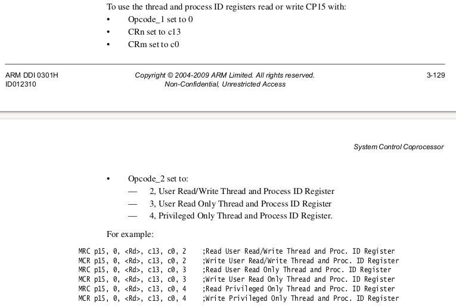
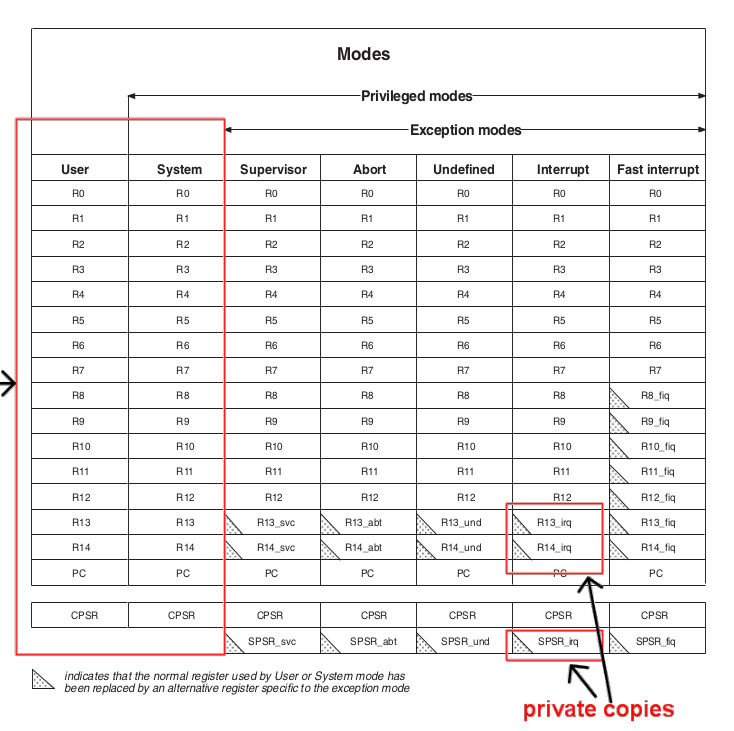
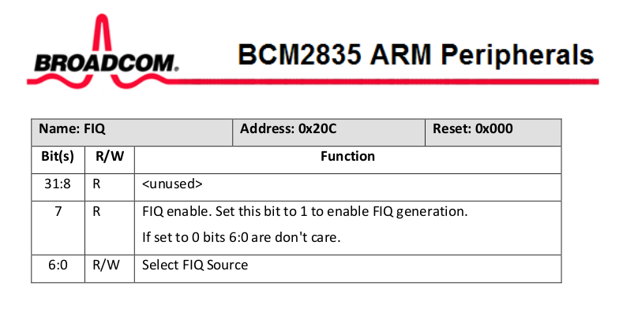
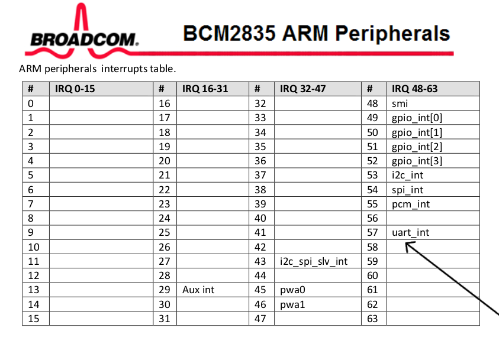

## Making a fast interrupt-based digital analyzer.

***NOTE: this lab is still getting written so you'll have to pull later
sections***

This is a fun lab: you'll make GPIO interrupts as fast as possible.
If you beat the final staff numbers by a non-noise amount I'll give you
$100 :).  

Two favorite things about the lab: 
  1. Optimizing tends to produce fun flow states.  When tuning my version
     I was staying up til 3am and waking up thinking about hacks to cut
     cycles for days in a row.  When you get up to my age you'll realize
     how rare such days are :).

  2. The starter code is small + and you've seen it before so there's
     not alot to worry about besides your own ideas and hardware features
     / implications.

#### Starter code: `code/gpio-int.c` and `code/interrupt-asm.S`

The starter code measures how long it takes to handle a GPIO generated
interrupt.  There are two files:
  - `code/gpio-int.c`: C code that sets up interrupts on rising and falling
    edges of a single GPIO pin, and then uses a simple loop to trigger
    them by alternatively writing 1 and 0 and measure the overhead.

  - `code/interrupts-asm.S`: assembly code to define the interrupt/exception 
    table and forward interrupts to C code.

The code is simple but slow.  Your job is to speed it up as much
as possible.  The code is roughly the same as examples you've seen in
140e's device interrupt lab (lab 8) and 240lx's IR lab (lab 3).

Why do we want fast interrupts?
  1. The more we can do per second.  Throughput is money!
  2. The faster our response can be.  Latency is money!
  3. The more other work we can get done.
  4. The less chance (ideally 0) that we lose an interrupt.  ("Why?")
  5. The better timing accuracy we can get.  Accurate timing can be the
     difference between correct and broken.

     Examples of why accuracy good: running time-based digital protocols
     fast and for measuring what is going on (e.g., building a logic
     analyzer: later lab!).

     Why fast = accuracy: the faster the interrupt handler is, the less
     stuff does.  In general, each thing it does is a coin toss that can
     take a varying amount of time (either directly or by conflicting with
     something else).  The less tosses, the less variance (accuracy).
     You don't have to believe me: you'll see variance drop as you tune
     the code.

#### Checkoff

The rest of the README discusses the different tricks I did and the
speedups I got.   You should implement each one and see that you got
roughly the same speedups.  Many hacks exploit previous topics we've
covered so serve both as a good, deeper review and as a payoff of knowing
stuff.  Each hack will also serve as a simple, concrete cheat-sheet of
examples you can look at later in your career.

  - NOTE: you won't get the same speedups because of different
    compiler and hardware issues --- by the end of the lab you'll have a
    much better understanding of the ways spurious differences can arise.

Alternatively, you can --- and are encouraged to! --- do the lab 
in two other ways:
  1. Max Mode: just take the code and optimize, ignoring the rest of
     the README.  You'll learn the Maximum amount.
  2. Daniel mode: same, but also read the sentence or two descriptons of
     what tricks we did as a reference.  

In any case, hopefully you figure out some new tricks because I would
like to make the code faster!

----------------------------------------------------------------------
### Workflow for optimizing code

#### Mechanical Workflow

After initial wins, optimizing code commonly:
  1. Has small steps that are hard to name for a git commit.
  2. Many dead ends.

What I would do:
  1. Have a text file where you write down what you do and then
     copy and paste the measured performance.

  2. Each time you make a real improvment make a subdirectory with
     a clearly sequential naming scheme and copy the entire directory 
     there.  For example, before modifying anything:

            % cd code
            % mkdir 0-start
            % cp * 0-start

     After the lab I have:

            % ls
            0-start     3-global-reg  6-vm	  
            1-inline    4-set-cnt	  7-goto  
            2-simplify  5-fiq	  8-wfi

I know this sounds incredibly boomer.  But it's simple-dumb in a way
that just works.  It's a lifesaver to have a series of clearly described
checkpoints that you can go back and forth between --- for example, when
you discover you broke something and need to narrow down when it was.
The fact you can just change directories and run the checkpoint with a
simple "make" is much much much better than trying to figure out some
git commit log.


#### Rules for speed

Some absolute rules:
  1. Measure any change.  People who don't know how to code are notorious
     for doing something that "should speed things up" and yet never
     measure that it does, thereby making the code more complex /
     fragile for nothing (or even slower).  

     Entire research fields have leapt forward after (finally) embracing
     this rule.  E.g., SAT and constraint solvers.  (Arguably: AI.)

  2. Do a single change at a time and measure it.  Don't do 10 at once,
     or even two.  If you do two changes and speed improved it doesn't
     mean both were good.  Sometimes one will have no or actually slow
     things down.

     A secondary reason to do less and measure: the smaller the steps
     you take more more you can notice when you do something that
     has more of an impact than you expected (part 7 below).  On modern
     hardware, seemingly incidental changes can make a real difference.

  3. Constantly look at the machine code.  This will tell you where
     cycles are being wasted.  In today's lab: if you don't see multiple
     times where the compiler has done something dumb, you're not looking
     often enough.

  4. Keep it simple.  Simple code is much easier to make fast
     versus complex.  (Just like anything else!)


----------------------------------------------------------------------
### Step 0: our starting point.

Our first run is awful:
```
0: rising	= 3608 cycles
1: falling	= 3193 cycles
2: rising	= 3244 cycles
3: falling	= 3190 cycles
4: rising	= 3244 cycles
5: falling	= 3184 cycles
6: rising	= 3244 cycles
7: falling	= 3198 cycles
8: rising	= 3258 cycles
9: falling	= 3198 cycles
10: rising	= 3244 cycles
11: falling	= 3184 cycles
12: rising	= 3253 cycles
13: falling	= 3202 cycles
14: rising	= 3250 cycles
15: falling	= 3201 cycles
16: rising	= 3256 cycles
17: falling	= 3190 cycles
18: rising	= 3252 cycles
19: falling	= 3184 cycles
ave cost = 3238.483647
```

Bad things:
  1. Interrupt cost is huge: average = 3238 cycles.  By default 
     the pi runs at 700MHz cycles per second, so we can do *at best* about 
     216,182 interrupts per second (700 * 1000 * 1000 / 3238).

     For comparison: as you saw in the PMU lab, a single cached
     non-pipelined add instruction takes 1 cycle.  3238 is 
     alot of instructions!

  2. The times bounce around significantly (min: 3184, max: 3608).
     It would be laughable to use this for something like the ws2812b
     or a logic analyzer.

----------------------------------------------------------------------
### Step 1: do the easy stuff.

It's pretty common that when you decide to optimize  there's a bunch
of dumb extra stuff in the code that you can cut out immediately.
This code is no different.

Interrupt handler:
  1. Cut out the global variable `n_interrupt` in the interrupt handler. 
     In the current code it is redundant with the rising and falling
     counters.  (Saves about 100 cycles.)
  2. Got rid of `gpio_event_detected` check since we only expect to handle
     a single interrupt source --- this required some expensive reads
     so dropped us down to about 2400 cycles!
  3. Got rid of the `dev_barrier` calls since we know the test
     generation only triggers GPIO interrupts while manipulating
     GPIO state. (Improved less than I thought, to about 2226
     cycles.)

This takes a couple minutes, and improves performance by about
a third:

```
0: rising	= 2516 cycles
1: falling	= 2168 cycles
2: rising	= 2253 cycles
3: falling	= 2165 cycles
4: rising	= 2270 cycles
5: falling	= 2173 cycles
6: rising	= 2258 cycles
7: falling	= 2173 cycles
8: rising	= 2272 cycles
9: falling	= 2159 cycles
10: rising	= 2258 cycles
11: falling	= 2171 cycles
12: rising	= 2275 cycles
13: falling	= 2165 cycles
14: rising	= 2253 cycles
15: falling	= 2165 cycles
16: rising	= 2253 cycles
17: falling	= 2191 cycles
18: rising	= 2272 cycles
19: falling	= 2165 cycles
ave cost = 2228.483647
```

Experiment with different optimization levels.  In the Makefile
change `OPT_LEVEL` from the default `-Og` to higher levels and see how
performance improves (-O1, -O2, -O3, -Ofast).  For me, `-Ofast` shaved
another hundred or so cycles off:

```
0: rising	= 2151 cycles
1: falling	= 1972 cycles
2: rising	= 1937 cycles
3: falling	= 1985 cycles
4: rising	= 1951 cycles
5: falling	= 1991 cycles
6: rising	= 1956 cycles
7: falling	= 1991 cycles
8: rising	= 1939 cycles
9: falling	= 1972 cycles
10: rising	= 1956 cycles
11: falling	= 1976 cycles
12: rising	= 1934 cycles
13: falling	= 1976 cycles
14: rising	= 1951 cycles
15: falling	= 1977 cycles
16: rising	= 1951 cycles
17: falling	= 1975 cycles
18: rising	= 1937 cycles
19: falling	= 1982 cycles
ave cost = 1973.0
```

Not bad for some pretty quick changes.


Now copy this into a subdirectory so we can always go back to it!

    % mkdir 1-simple
    % cp * 1-simple

----------------------------------------------------------------------
### Step 2: inline inline inline.

In general, the second easy thing to do is to inline key calls.
This has the obvious benefit of getting rid of the procedure call and
return overhead.  It has the secondary (sometimes much more) benefit of
letting the compiler optimize  and specialize the function body to the
callsite.  

So make inline versions of:
  1. `gpio_read`
  2. `gpio_write`
  3. `gpio_event_clear`.

Note: you probably have these in your old 240lx labs for the light array
and other labs.

How:
  1. I would suggest copying your old GPIO code into a new header file
     `gpio-raw.h` into this directory so you can collect all your
     inlined code and use it in other labs.
  2. Make each routine into a `static inline` routine, with a slighly
     altered name (e.g., `gpio_read_raw`, `gpio_set_off_raw`,
     `gpio_set_on_raw`, `gpio_event_clear_raw`).
  3. Cut out all error checking in the routines. 
  4. Use `volatile` pointers instead of `PUT32` and `GET32`.
  5. When you look at the disassembled file (`gpio-int.list`) for
     the interrupt handler and the timing code (`test_cost`) you should
     see no PUT32, GET32 or gpio calls.


This speeds up the code by almost a factor of two!  This is great,
since it's not hard:

```
0: rising	= 1147 cycles
1: falling	= 1000 cycles
2: rising	= 1006 cycles
3: falling	= 999 cycles
4: rising	= 1003 cycles
5: falling	= 1000 cycles
6: rising	= 1009 cycles
7: falling	= 997 cycles
8: rising	= 1004 cycles
9: falling	= 1000 cycles
10: rising	= 1006 cycles
11: falling	= 1002 cycles
12: rising	= 1000 cycles
13: falling	= 1002 cycles
14: rising	= 1009 cycles
15: falling	= 999 cycles
16: rising	= 1003 cycles
17: falling	= 999 cycles
18: rising	= 1006 cycles
19: falling	= 999 cycles
ave cost = 1009.500000
```

----------------------------------------------------------------------
### Step 3: get rid of the interrupt conditional

We stated above you should look at your interrupt routine 
(`int_vector:gpio-int.list`).  So let's do so:

```
00008050 <int_vector>:
    8050:   e59f3030    ldr r3, [pc, #48]   ; 8088 <int_vector+0x38>
    8054:   e59f2030    ldr r2, [pc, #48]   ; 808c <int_vector+0x3c>
    8058:   e5933034    ldr r3, [r3, #52]   ; 0x34
    805c:   e3130302    tst r3, #134217728  ; 0x8000000
    8060:   05923000    ldreq   r3, [r2]
    8064:   15923004    ldrne   r3, [r2, #4]
    8068:   02833001    addeq   r3, r3, #1
    806c:   12833001    addne   r3, r3, #1
    8070:   05823000    streq   r3, [r2]
    8074:   15823004    strne   r3, [r2, #4]
    8078:   e3a02302    mov r2, #134217728  ; 0x8000000
    807c:   e59f3004    ldr r3, [pc, #4]    ; 8088 <int_vector+0x38>
    8080:   e5832040    str r2, [r3, #64]   ; 0x40
    8084:   e12fff1e    bx  lr
    8088:   20200000    .word   0x20200000
    808c:   000098cc    .word   0x000098cc
```

Our main goal is to make this shorter.  

If you look at the machine code, there's a bunch of loads (we get rid
of these next), and a conditional (`tst`) where the handler does
a GPIO read and checks its value to determine whether to increment the
rising or falling edge counter.

In many cases, you can speed code up by changing it to compute a weaker
result that will work just as well.  And this is no different.  

We can get rid of this instruction easily since for our measurement
purposes we don't actually care if it's a rising or a falling edge,
we just care that the code handled an interrupt.  So we rewrite the
handler to:
  1. Eliminate the rising and falling edge variables
  2. Get rid of the conditional and `gpio_read`
  3. Put the `n_interrupt` global back in that we got rid of in part 1.
  4. Change `test_cost` to just check this variable.  For example:
```
    ...
    let n = n_interrupt;
    gpio_set_on_raw(pin);
    while(n_interrupt == n)
        ;
    e = cycle_cnt_read();
```

Obviously we're redoing something we could have done right the first time.
But this is not uncommon at all to:
  1. Do a modification to speed up code.
  2. Do a few other speed modifications.  
  3. And then have to roll back the original (change 1) and do it
     differently.


This change cuts about 100 cycles, a bit over a 10% improvement.
You'll notice that the speedups are coming in smaller amounts.
Unfortunately this is common as you get rid of the low hanging fruit.

```
0: rising	= 1012 cycles
1: falling	= 891 cycles
2: rising	= 891 cycles
3: falling	= 891 cycles
4: rising	= 895 cycles
5: falling	= 966 cycles
6: rising	= 897 cycles
7: falling	= 890 cycles
8: rising	= 892 cycles
9: falling	= 887 cycles
10: rising	= 892 cycles
11: falling	= 890 cycles
12: rising	= 894 cycles
13: falling	= 890 cycles
14: rising	= 889 cycles
15: falling	= 890 cycles
16: rising	= 892 cycles
17: falling	= 893 cycles
18: rising	= 892 cycles
19: falling	= 890 cycles
ave cost = 901.200012
```

----------------------------------------------------------------------
### Fun weirdness

You interrupt handler can look like:

```
void int_vector(uint32_t pc) {
    n_interrupt++;
    gpio_event_clear_raw(in_pin);
}
```

Or:

```
void int_vector(uint32_t pc) {
    gpio_event_clear_raw(in_pin);
    n_interrupt++;
}
```

If you measure the cost, the latter increases it from about 900 to 921.
You should file this weirdness away for later.  (Or figure out what is
going on :).

----------------------------------------------------------------------
### Step 4: use global registers to eliminate loads.

If you look at the interrupt handler now its 8 instructions, a bit
more than about half the size:

```
00008050 <int_vector>:
    8050:   e3a00302    mov r0, #134217728  ; 0x8000000
    8054:   e59f2014    ldr r2, [pc, #20]   ; 8070 <int_vector+0x20>
    8058:   e59f1014    ldr r1, [pc, #20]   ; 8074 <int_vector+0x24>
    805c:   e5923000    ldr r3, [r2]
    8060:   e2833001    add r3, r3, #1
    8064:   e5823000    str r3, [r2]
    8068:   e5810040    str r0, [r1, #64]   ; 0x40
    806c:   e12fff1e    bx  lr
    8070:   000098ac    .word   0x000098ac
    8074:   20200000    .word   0x20200000
```

This is a great improvement, but it's still far from zero so let's keep
going.

The worse problem in the code are the load (`ldr`) instructions 
at 8054, 8058 and 805c.  These will be cache misses since we aren't
running with the data cache.  We could  enable the data cache, but 
that will:
  1. Require virtual memory and a bunch of complexity.
  2. Generally only usually, not always work --- thereby introducing
     big spikes of jitter / error.

Instead we just try to get rid of the load instructions.  

So why do we have the two initial loads?
```
    8054:   e59f2014    ldr r2, [pc, #20]   ; 8070 <int_vector+0x20>
    8058:   e59f1014    ldr r1, [pc, #20]   ; 8074 <int_vector+0x24>
```
If you look the word at 8070 it is the address of `n_interrupt`:
```
    8070:   000098ac    .word   0x000098ac
```

The second the word at 8074 is 
the base address of GPIO, used by your event clear code:
```
    8074:   20200000    .word   0x20200000
```

Why does the code look like this?  ARM instructions are only 32-bits,
so requires multiple instructions to load an arbitrary 32-bit constant in
a single instruction.  For our code, the ARM compiler made the decision
to put the constant it wanted in the code segment (at 8070 and 8074)
so it could load it using a single ldr instruction using a small offset
from the program counter register (pc).

But, in any case, loads suck for performance.  So we use a trick from the
240lx `9-profiler` lab to get rid of them by storing these two constants
into ARM's global scratch registers instead of memory!

To review: the arm1176 provides (at least) three coprocessor scratch
registers for "process and thread id's."  However, since the values are
not interpreted by the hardware, they can be used to store arbitrary
values.  The screenshot of page 3-129 (chapter 3 of the `arm1176.pdf`
manual) below gives the instructions.

<p align="center">
  
</p>

You can steal your old code for definition the accessors for these
registers.  I used the `cp_asm_raw` helpers:

    #include "asm-helpers.h"
    cp_asm_raw(cp15_scratch2, p15, 0, c13, c0, 3)
    cp_asm_raw(cp15_scratch1, p15, 0, c13, c0, 2)


How to change the code to use the global registers:
  1. Store the GPIO event clear address into one scratch register.
     Change the interrupt handler to use this global variable rather
     than the large constant.
  2. Delete the `n_interrupt` variable entirely and just use 
     another global scratch register to track it.  Change the 
     test code and interrupt handler to use the global register instead.
  3. Before running the test code, initialize the global registers.
  4. Don't mix up which one holds which!  (You code will just lock up.
     Why?)

If you look at the interrupt handler code (our theme song) you can see
this one change removed the two loads we wanted, and also removed the
store to `n_interrupt`.
```
00008050 <int_vector>:
    8050:   ee1d3f70    mrc 15, 0, r3, cr13, cr0, {3}
    8054:   e2833001    add r3, r3, #1
    8058:   ee0d3f70    mcr 15, 0, r3, cr13, cr0, {3}
    805c:   ee1d3f50    mrc 15, 0, r3, cr13, cr0, {2}
    8060:   e3a02302    mov r2, #134217728  ; 0x8000000
    8064:   e5832000    str r2, [r3]
    8068:   e12fff1e    bx  lr
```
While it's only 1 instruction shorter, changing memory operations
to co-processor instructions makes a huge difference!  Almost 2x!

```
0: rising	= 687 cycles
1: falling	= 595 cycles
2: rising	= 589 cycles
3: falling	= 593 cycles
4: rising	= 591 cycles
5: falling	= 598 cycles
6: rising	= 589 cycles
7: falling	= 595 cycles
8: rising	= 589 cycles
9: falling	= 598 cycles
10: rising	= 583 cycles
11: falling	= 595 cycles
12: rising	= 588 cycles
13: falling	= 595 cycles
14: rising	= 588 cycles
15: falling	= 595 cycles
16: rising	= 588 cycles
17: falling	= 598 cycles
18: rising	= 591 cycles
19: falling	= 598 cycles
ave cost = 597.150024
```

----------------------------------------------------------------------
### Step 5: housekeeping

Now that we reduced our timings down so much, we do some basic
housekeeping so that we don't get spurious speedups and slowdowns because
of changing instruction alignment.  Recall that the instruction prefetch
buffer is 32-bytes, where the first instruction address in each fetch is
32-byte aligned.  If our code can be read in a single prefetch it will
run noticably faster than if it takes two.  Unfortunately if we don't
force alignment, random changes in the one part of the code can cause
cascading alignment changes in all subsequent (unrelated) code locations
leading to big timing swings.  (We should have done this sooner, but I
forgot and am too lazy to remeasure.)

We care about:
  1. The interrupt trampoline: we want this 32-byte aligned so the
     initial jump to it loads all useful instructions.  We add an
     `.align 32` directive before the interrupt trampoline in the
     `interrupt-asm.S` assembly file:

                .align 5
                interrupt:

  2. The interrupt handler itself: as with the interrupt trampoline
     we want all prefetched instructions to be useful.  We add a GCC
     attribute directive before the start of the interrupt code in the
     `scope.c` file:

            __attribute__((aligned(32))) void int_vector(uint32_t pc) 
            {
                ....

  3. Finally, in the two locations in the test generation code where
     we write to the GPIO and read the cycle counter.  We do so because
     our overhead measurements are at the mercy of how accurate this
     initial cycle count read is: if the read is the last instruction
     in the prefetch buffer, and the write to GPIO is the first 
     in the next one, there will be a big lag before it executes,
     falsely making us think our interrupt overhead is higher. 


            asm volatile(".align 5");
            s = cycle_cnt_read();
            gpio_set_on_raw(pin);

You can check that all of these worked by looking for the addresses of
each and making sure that they are divisible by 32.

Alignment made about 30 cycles difference for me.  It might make more
or less for you --- this variance is why we did this change :).

And as foreshadowing: at some point I accidently deleted (step 3) above,
and wasted a lot of time chasing something that was just an artificial
slowdown because of a alignment issue.

```
0: rising	= 666 cycles
1: falling	= 549 cycles
2: rising	= 546 cycles
3: falling	= 549 cycles
4: rising	= 546 cycles
5: falling	= 549 cycles
6: rising	= 544 cycles
7: falling	= 549 cycles
8: rising	= 547 cycles
9: falling	= 549 cycles
10: rising	= 546 cycles
11: falling	= 558 cycles
12: rising	= 555 cycles
13: falling	= 549 cycles
14: rising	= 558 cycles
15: falling	= 546 cycles
16: rising	= 549 cycles
17: falling	= 544 cycles
18: rising	= 546 cycles
19: falling	= 552 cycles
ave cost = 554.850036
```

----------------------------------------------------------------------
### Step 6: get rid of interrupt counter read

As mentioned above, speeding up code means constantly mulling over the
question "can I get the same result by doing less?"

If you look at your interrupt code, the answer is yes: 
  - We don't actually need the count of interrupts (which requires
    reading and then writing the counter), we just care that an interrupt
    happened (this requires a single set).
  - So change the test code to set the interrupt register to 0 before
    spinning (wait for it to become non-zero) and the interrupt to set
    it to 1.


For example in `test_cost`:
```
        ...
        n_int_set(0);
        asm volatile(".align 5");
        c = cycle_cnt_read();
        gpio_set_on_raw(pin);
        while(!n_int_get())
            ;
        e = cycle_cnt_read();
        ...
```
Note: we put the `n_int_set` before the alignment since the operation to
set it to zero is not important for speed.  Interestingly: If I didn't
do this I didn't get any speedup.


If you look at the interrupt handler we've removed one instruction.
```
00008060 <int_vector>:
    8060:   e3a03001    mov r3, #1
    8064:   ee0d3f70    mcr 15, 0, r3, cr13, cr0, {3}
    8068:   ee1d3f50    mrc 15, 0, r3, cr13, cr0, {2}
    806c:   e3a02302    mov r2, #134217728  ; 0x8000000
    8070:   e5832000    str r2, [r3]
    8074:   e12fff1e    bx  lr
```


This gives us a modest speedup from 552 cycles to 549.  However,
importantly, it makes the next change we do easier.

```
0: rising	= 665 cycles
1: falling	= 538 cycles
2: rising	= 543 cycles
3: falling	= 538 cycles
4: rising	= 546 cycles
5: falling	= 538 cycles
6: rising	= 546 cycles
7: falling	= 538 cycles
8: rising	= 546 cycles
9: falling	= 538 cycles
10: rising	= 546 cycles
11: falling	= 540 cycles
12: rising	= 557 cycles
13: falling	= 538 cycles
14: rising	= 543 cycles
15: falling	= 544 cycles
16: rising	= 543 cycles
17: falling	= 546 cycles
18: rising	= 555 cycles
19: falling	= 538 cycles
ave cost = 549.299987
```

In addition, if you look at the results we have massively reduced
variance:
  - Before we had a random jumps to 630 cycles. 
  - Whereas here other than the initial measurement, the cost bounces
    between 538 to 555.  Removing operations often cuts variance, though
    in non-deterministic ways.

I should have measured variance in addition to average --- it would
be great if you do!


----------------------------------------------------------------------
### Step 5: do it all in assembly

One big overhead: all the extra instructions used by the interrupt
trampoline (`interrupt-asm.S:interrupt`) to save and restore registers
before calling `int_vector`.    We now get rid of this.

One nice thing about trimming so many instructions is that now the
interrupt handler machine code is tiny, which means we can easily just
write it directly in assembly code.  (This dynamic is not uncommon!) 

The reason for doing so here is not that assembly isn't necesarily magic,
but in this case it lets us:
  1. Inline the C interrupt handler into the assembly trampoline and then
     optimize across the boundaries.  We've already seen how this 
     helps the compiler, but it also helps hand optimization.
  2. Once we've done step 1, we can then play games with the registers
     that the C compiler can't necessarily. 

        - NOTE: the `arm-none-eabi-gcc` compiler does let you tag
          exception routines with an attribute specifying what exception
          they are for.  In the general case this may provide some
          automatic optimization (try it and let me know!).  However,
          in this case,  we're playing games with the SP that make
          this impossible (afaik, but I didn't ponder long).


```
00008060 <int_vector>:
    8060:   e3a03001    mov r3, #1
    8064:   ee0d3f70    mcr 15, 0, r3, cr13, cr0, {3}
    8068:   ee1d3f50    mrc 15, 0, r3, cr13, cr0, {2}
    806c:   e3a02302    mov r2, #134217728  ; 0x8000000
    8070:   e5832000    str r2, [r3]
    8074:   e12fff1e    bx  lr
```

To do the change, I took most of this code and:
  1. Put all the instructions other than the 
     "bx lr" in the assembly trampoline 
     `interrupt-asm.S:interrupt`
  2. To reduce the need to save and restore registers, 
     I abused the sp register (recall: the interrupt handler
     has a private shadow copy) as a general purpose register.
  3. After (2): Only saved and restored the two registers.


***NOTE: need to fill in these numbers.***


NOTE:
  - One easy change we could have done earlier but didn't
    was to change the trampoline to only save and restore the caller-saved
    registers --- currently it saves a bunch of callee as well.
  - A second sleazy change would be to get rid of the initial 
    jump to the interrupt trampoline.  Since we do not have any
    other exceptions or interrupts, just inline the trampoline
    right into the vector table, ignoring the subsequent 
    slots (in our case, since the interrupt is the last entry
    in the table before FIQ)  xxx.

----------------------------------------------------------------------
### Step 6: do it as a "fast interrupt" (FIQ)

***NOTE: at this point I'm still adding stuff.  The rest of the lab
just has high bits.  Will add more writing.  Tuesday's lab will
just be continuing the quest.***

Looking at the machine code, we still push a couple of registers, which
means we have to have a stack pointer, as well as some extra management.
We can eliminate all of this by using "fast interrupt" mode.  If you
look in chapter 4 of the armv6 document you can see that FIQ mode has
six shadow registers, R8-R14.



How do we do this?  If you look at the BCM interrupt chapter (see
lab 4 "interrupts" and lab 8 "device interrupts" of 140e), you can 
see how to set up the FIQ.

The FIQ reg itself:


So we have to set the 7th bit to 1 and write the interrupt
source into the lower 6 bits.  The interrupt source is
given in:

Since we want one of the first 32 GPIO pins, this is GPIO0, which is 49.

There's different ways to do this.  The easiest way for me was to make
versions of my gpio interrupt routines that setup the FIQ instead.

    void gpio_fiq_rising_edge(unsigned pin);
    void gpio_fiq_falling_edge(unsigned pin);


And use these during setup.  I also made a special FIQ table, and an 
FIQ initialization routine in assembly.  

So `notmain` becomes:

```
    void notmain(void) {
        ...
    
        // setup FIQ
        extern uint32_t fiq_ints[];
        vector_base_set(fiq_ints);
        output("assigned fiq_ints\n");

        gpio_fiq_rising_edge(in_pin);
        gpio_fiq_falling_edge(in_pin);

        fiq_init();
```

To initialize the FIQ registers I used the "cps" instruction to switch
into `FIQ_MODE` and setup the FIQ registers to hold the pointers and
values I want, and then back to `SUPER_MODE` (make sure you prefetch
flush!).  I then put a panic in the original `int_handler` to verify we
weren't calling it.

And finally as a hack I used the preprocessor to give the different
registers "variable names" so I didn't do any stupid mistakes.

    // in interrupt-asm.S
    #define event0      r8
    #define event0_val  r9
    #define cur_time    r10
    #define cur_cycle   r11


After rewriting the code to exploit the FIQ registers, I got it down
to 5 instructions:
  1. cycle count read.
  2. one store to clear the event interrupt
  3. one store to write out the current cycle time.
  4. one write of the co-processor scratch register to write back
     a pointer to the next timer reading (more on this later).
  5. a jump back to the interrupted code.

This gives a great performance improvement: 
   1. Without icache on: around 290 cycles.
   2. With icache on about 166 cycles.
Which is more than 10x faster than our originally!

***NOTE: have to replicate the numbers: check back!***

----------------------------------------------------------------------
### Step 7: Icache.

This is easy.  We turn on the icache and write the code to measure
both with and without.

As usual we have a large cost for the first value --- we can eliminate
this by either doing a warmup or a prefetch.

----------------------------------------------------------------------
### Step 8: data cache, bcm access


At this point, I ran out of low-hanging fruit ideas for how to bum cycles,
so it's time to change the rules.  Our first hack will be to use virtual
memory to speed things up.   It sounds counter-intuitive that adding
an extra layer of machinery helps speed in any way, but on the arm1176
virtual memory gives us (at least) two ways to speed up our code:

  1. With virtual memory off, the access rules for BCM memory default to
     "strongly ordered".  If you look at the other rules (6-15) you
     see there is also a "device shared" and a "device not shared".
     With some simple tests, it appears that both reads and write for
     device shared are faster than strongly ordered.  (I couldn't get
     "device not shared" to work.)  It makes sense to exploit this.

  2. With virtual memory off, the data cache is off, and each memory
     store blocks until the write to memory completes.  Memory is slow,
     so this is slow.  We can make stores non-blocking by enabling the
     "write buffer" functionality in the data cache --- so that they
     get buffered in the fixed size write buffer which later retires
     them to memory, without requiring the store wait.

For this I used pinned memory to do an identity map pin of the code.
First, I ran with the default to double check the timings and to make
sure the identity map worked.

Then I did the following:
  1. Set the write-back functionality in the cp 15 control register 1
     (the 4th bit, see 3-45).

  2. Set the memory attribute for the bcm mapping (see `mem-attr.h`) to:

            // 6-15
            MEM_share_dev   = TEX_C_B(    0b000,  0, 1),

  3. Set the data segemtn to write-back allocate (I didn't
     see a difference for write-back no allocate):

            // 6-15
            MEM_wb_alloc   =  TEX_C_B(    0b001,  1, 1),

I got it down to about 140:

```
0: rising = 141 cycles
1: falling = 142 cycles
2: rising = 141 cycles
3: falling = 142 cycles
4: rising = 141 cycles
5: falling = 142 cycles
6: rising = 141 cycles
7: falling = 142 cycles
8: rising = 141 cycles
9: falling = 142 cycles
10: rising = 141 cycles
11: falling = 142 cycles
12: rising = 141 cycles
13: falling = 142 cycles
14: rising = 141 cycles
15: falling = 142 cycles
16: rising = 141 cycles
17: falling = 142 cycles
18: rising = 141 cycles
19: falling = 142 cycles
```

----------------------------------------------------------------------
### Step 9: goto

Currently the test code spins in a loop waiting for the interrupt handler
to set a global register.  The cost of this read, check, and branch 
will always be added to the cost of the interrupt.  We can get rid of
it with slighly a weird trick.  Rewrite the code to *not* check for 
an interrupt, but instead write a continuation address to a location
that the interrupt handler can jump to when it returns.  
This means the code does not have to check anything but will run
immediately.


So instead of:
```
        let f = n_int_get();
        c = cycle_cnt_read();
        gpio_set_off_raw(pin);
        while(!n_int_get())
            ;
        e = cycle_cnt_read();
```

We do something like this pseudo-code: 
```
        c = cycle_cnt_read();
        gpio_set_off_raw(pin);
        while(1)
            ;
        resume_label:
            e = cycle_cnt_read();
```
And have the interrupt handler jump to the resume label always.


This got me down to:


```
0: rising = 159 cycles
1: falling = 114 cycles
2: rising = 132 cycles
3: falling = 112 cycles
4: rising = 113 cycles
5: falling = 112 cycles
6: rising = 113 cycles
7: falling = 112 cycles
8: rising = 113 cycles
9: falling = 112 cycles
10: rising = 113 cycles
11: falling = 112 cycles
12: rising = 113 cycles
13: falling = 112 cycles
14: rising = 113 cycles
15: falling = 112 cycles
16: rising = 113 cycles
17: falling = 112 cycles
18: rising = 113 cycles
19: falling = 112 cycles
```

----------------------------------------------------------------------
### Step 10: async GPIO

If you notice we are using sync GPIO events, we can switch to async
for a couple cycles.

----------------------------------------------------------------------
### Step 11: wait for interrupt

If you search in chapter 3 you see there is a "wait for interrupt"
instruction.  Use it!


With the cache on it got around 98 cycles!

```

0: rising = 268 cycles
1: falling = 99 cycles
2: rising = 108 cycles
3: falling = 98 cycles
4: rising = 98 cycles
5: falling = 98 cycles
6: rising = 98 cycles
7: falling = 98 cycles
8: rising = 98 cycles
9: falling = 98 cycles
10: rising = 98 cycles
11: falling = 98 cycles
12: rising = 98 cycles
13: falling = 98 cycles
14: rising = 98 cycles
15: falling = 98 cycles
16: rising = 98 cycles
17: falling = 98 cycles
18: rising = 98 cycles
19: falling = 98 cycles
jump in fiq II
FIQ defined
gpio-int.c:282: test cost:
    cycles=3922
    dcache miss=0
    icache miss=5
0: rising = 104 cycles
1: falling = 104 cycles
2: rising = 104 cycles
3: falling = 104 cycles
4: rising = 104 cycles
5: falling = 104 cycles
6: rising = 104 cycles
7: falling = 104 cycles
8: rising = 104 cycles
9: falling = 104 cycles
10: rising = 104 cycles
11: falling = 104 cycles
12: rising = 104 cycles
13: falling = 104 cycles
14: rising = 104 cycles
15: falling = 104 cycles
16: rising = 104 cycles
17: falling = 104 cycles
18: rising = 104 cycles
19: falling = 104 cycles
```

***NOTE: at this point I'm still adding stuff.  The rest of the lab
just has high bits.  Will add more writing.  Tuesday's lab will
just be continuing the quest.***
