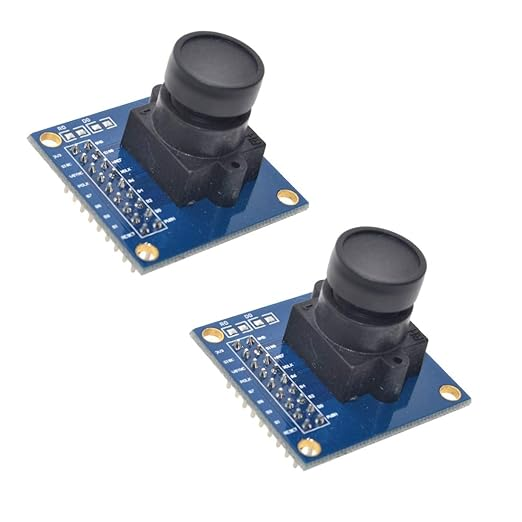
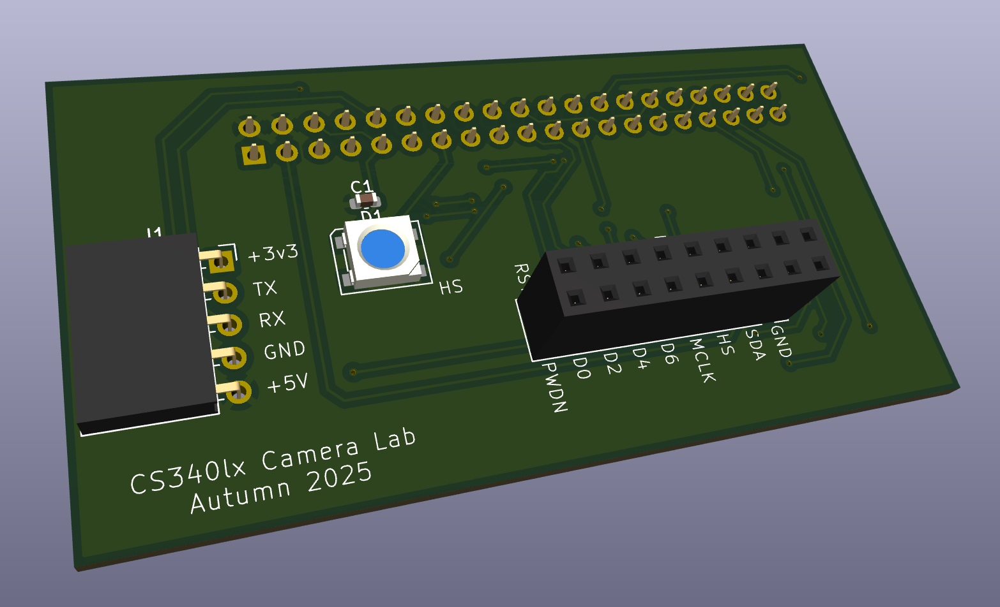
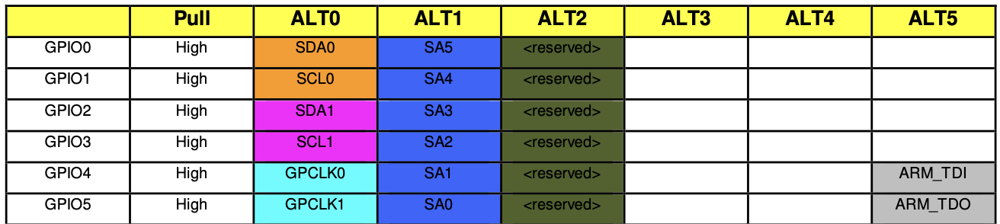
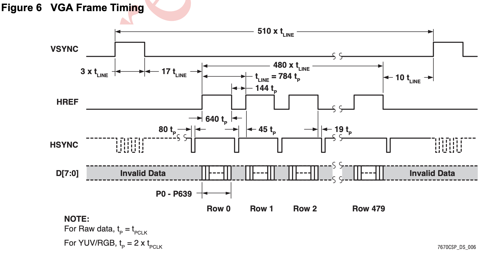
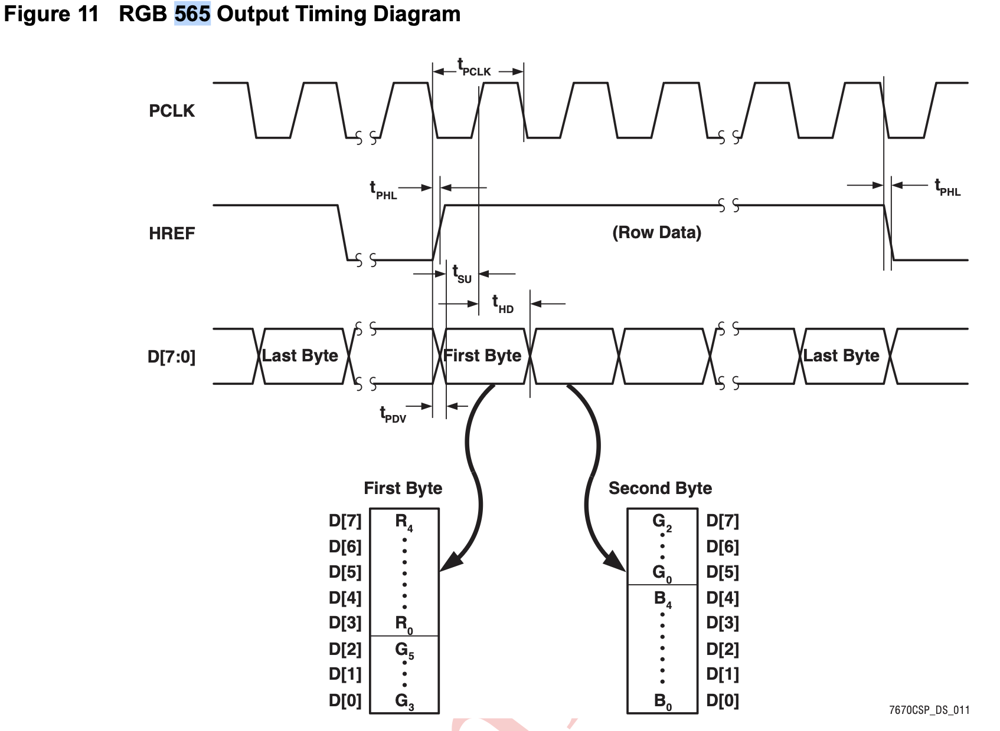

### OV7670 Camera

The OV7670 module is a camera module with a maximum array size of 640*480. It supports output formats such as RGB565, RGB555, RGB444, YUV, GRB, etc. Today, we're going to drive this camera and display the images on your HDMI display! You'll need the datasheet in the doc folder.

I made some PCBs so that we don't need to connect all the wires ourselves. The LED is connected to pin 27. It should blink between frames, but this is not obvious if the frame rate is high. If the light is on, it means the camera is working.

Today's lab has three parts. Part 1 is GPIO input/output setup. Part 2 is the camera's control register setup. Part 3 is reading pixels from the camera and showing them on the HDMI display. Have fun!

----------------------------------------------------------------------
### Part 1: GPIO setup

In this part, we will set up the GPIO pins and initialize I2C.

The wiring is done by the PCB. Use `ov7670_staff.o` to test if the PCB is working. If you don't want to use the PCB, connect using this table:

| Pin Name  | D0 | D1 | D2 | D3 | D4 | D5 | D6 | D7 | VS | HS | MCLK | PCLK | SDA | SCL | 3.3V | GND | RST  |
|-----------|----|----|----|----|----|----|----|----|----|----|------|------|-----|-----|------|-----|------|
| GPIO Pin  | 6  | 7  | 8  | 9  | 10 | 11 | 12 | 13 | 17 | 27 | 5    | 4    | 2   | 3   | 3.3V | GND | 19 |

* D0-D7 are data pins from the camera, so they are GPIO inputs.
* VS (Vertical Sync) and HS (Horizontal Sync) are synchronization signals from the camera, so they are GPIO inputs.
* PCLK (Pixel Clock) is the reference clock from the camera, so it is a GPIO input.
* RST (Reset) is the reset signal, so it is a GPIO output.
* SCL and SDA are set in the I2C initialization function.
* MCLK (Master Clock) is the master clock which drives the camera. **We're going to implement this pin**.

Complete the `camera_pins_setup()` function in `ov7670_init.c`. Specifically, you will: 
* Set up the master clock pin to General Purpose Clock 1 (GPCLK1).* Set up the clock divisor. Set the integer part to 0x64.
* Set up the clock source to PLLD. PLLD is a clock of 500MHz. So, if you set the divisor to 0x64 (which is 100 in decimal), the output clock frequency (the clock we output from MCLK to the camera) will be $500 \text{ MHz} / 100 = \mathbf{5 \text{ MHz}}$.

BCM2835 datasheet p.102-108 is useful:

See p.107 for GPIO clock control, and p.108 for clock divisor. 

The `code` folder includes the staff's implementation `i2c.o` and `mbox.o`. To drop in your own I2C driver and mbox implementation, add it to `COMMON_SRC` and 
remove `PREBUILT_OBJS` from the Makefile. 

Pass `1-pin-setup.c` before starting the next part. 
----------------------------------------------------------------------

Part 2: Control Register Setup
Before getting pixels from the camera, we need to set the camera's control registers so that it outputs with the desired frequency, format, and color.

There are around 200 configurable control registers, listed in p.11-26 in the OV7670 datasheet. Most of them are related to color (including brightness, contrast, and various matrices). If we only care about the correct frequency, image size, and data format, only a few of them need to be configured.

To set these registers, we will use the imu_wr() function to transmit the register address and data to the camera through I2C. Some examples are in camera_register_setup().

Complete the camera_register_setup() function in ov7670.c. Specifically, we want to:

Ensure the output image array is 640×480, which is the maximum size the camera supports.

Set the synchronization signal delay to 0.

Set the data format to RGB565 and the data range to 00-FF.

If you have time and want the image to look better, I listed some registers that are worth trying to tune. It took me several nights to balance colors, but it was fun!

Pass `2-camera-setup.c` before starting the next part. 

----------------------------------------------------------------------
### Part 3: Caputure image and show on HDMI display

Note: If you don't have a display, comment out `camera_display()` function and uncomment `print_camera_value()` to show the pixel values in terminal. 

To understand how the camera transmits data, the datasheet has a good diagram showing how VGA works:

The diagram illustrates the timing for a single frame.
* The vertical synchronization signal, VSYNC, indicates the start of a new frame. 
* The frame contains 480 rows (Row 0 to Row 479) of active data.
* The horizontal reference signal, HREF, indicates the start of an active line (row of data). 
* The active data period for one line is $640 \times t_{\text{P}}$.The total time for one line is $\mathbf{t_{\text{LINE}}} = 784 \times t_{\text{P}}$. 
* The data pins, D[7:0], transmit valid pixel data only when HREF is high. The data is clocked out by PCLK (where $t_{\text{P}}$ is the PCLK period).

The VGA synchronization is implemented in the function `camera_display()`. It's fun to look into this function to see if you can optimize it.

RGB565 data are packed in 2 bytes. Refer to the datasheet below:

Complete `extract_rgb565()` function in `ov7670.c` The function wait for the edge of HREF, read two bytes, rearrange the bits, and output the RGB pixel. 

If you connect your hdmi display and run `3-camera-display.c`, you should see the image (video) on the display. Make sure to set the enums in `mbox.h` based on your display!
