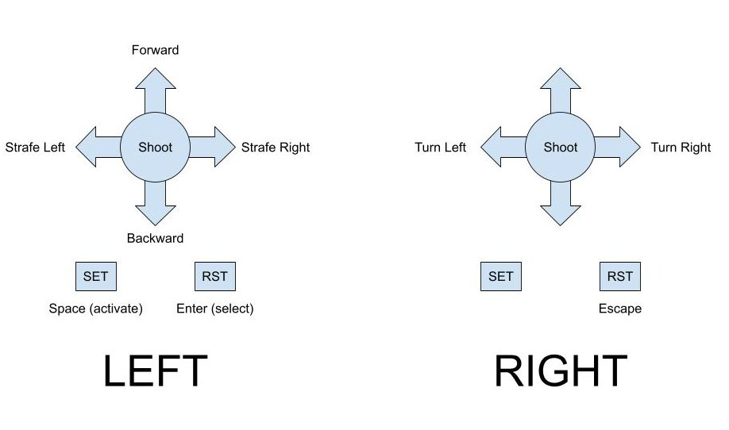

# PiDOOM

**Lab by: [Sai Konkimalla](mailto:saik.stanford.edu), [James Chen](mailto:jamesc27.stanford.edu)**

## Useful Links:

* https://github.com/Daivuk/PureDOOM (Header file with DOOM implementation)
 
## Introduction:

The core of this lab is the PureDOOM header file. This is an implementation of DOOM that is meant to be very easy to port to different interfaces. The way it works is that you need to provide it some basic functions (malloc, print, fileio, etc), and with those implementations it gives you a very simple interface to exectute button outputs, get the screen state, and get an audio stream. We give you an edited version of the header file with all of these auxillary functions already implemented for the pi, but feel free to just take the original header file and implement it yourself if you want the extra challenge! (fair warning though, the file io is significantly more complicated than your file system lab)

VERY IMPORTANT!!!

Before you start, make sure to put the doom1.wad file on your SD card. This contains a lot of the game data the header needs to be able to run.

Another thing is you might notice the game takes a long time to start since it is so big. One way to help deal with this is once you are happy with the state of the program, you can replace your bootloader with the doom binary and it will get loaded in by the GPU much faster!

## Step 0: [Optional] Test out staff code
To check and see how DOOM will run on your Pi, you can test out the staff binary [staff-doom.bin](code/staff-doom.bin). We used the following joystick to GPIO pin mapping:

```
enum {
    // Left joystick
    up_l_pin = 13,
    dwn_l_pin = 10,
    let_l_pin = 9,
    rht_l_pin = 7,
    mid_l_pin = 5,
    set_l_pin = 3,
    rst_l_pin = 1,

    // Right joystick
    let_r_pin = 23,
    rht_r_pin = 21,
    mid_r_pin = 19,
    rst_r_pin = 17,
};
```

## Step 1: Frame rendering

Luckily, now that we have done the HDMI lab this step should be pretty easy! You should be able to directly port your HDMI code to get this set up. The doom header file gives us a doom_get_framebuffer() function which outputs a single frame. The dimensions are set to 320 width, 200 height, and 32 bytes per pixel, so that is what you should use for the mailbox dimensions. Also, if you want to try out DMA or double buffering these help you get a faster frame rate or smoother game!

### Step 1.5: Fix the header

Once you get this working, you might notice that the frame rate is really really bad and keeps getting worse as time goes on. This is because there is a really big issue in the DOOM header file that leads to very poor performance. Luckily, there is a very easy fix! Take a look at the doom_update() and D_DoomLoop() functions and fix the performance issue (hint: you can make the fix by changing only two lines of code). 

Once you get that working, it should render relatively quickly. However, you might notice that all the textures on vertical walls are very weird. This is an issue we have probably looked into for 15-20 hours at this point and still have not been able to figure out. We have tried switching the decimal representation between custom fixed point, floating point software, and floating point hardware, we have introduced ckmalloc and redzoning, and gone through a ton of the header file code but can't find the actual issue. We believe the error is that some bytes are being swapped, maybe to do with the way we allocate / copy memory, but are not sure. We really want to see this fixed, so if anyone can solve this James is putting up a $50 bounty! Let us know if you want to try to solve this and we would be happy to talk more about what we have tried so far.

## Step 2: Joystick controls

For our original version of DOOM, we used a custom breadboard with buttons, but now we have a much better control system with the digital joysticks. We didn't have any actual documantation, but the joysticks are super simple, they just have a GPIO connection for each of the buttons. Other than that, we just used a helpful comment on Amazon: 

"Easy to interface to with any microcontroller (PIC/AVR/RPi/ESP32/STM/Arduino/etc), one side of all switches is tied to common, which you can tie to ground or high. I tied to ground and use internal CPU pullup resistors to bring line low on activation. The opposite can be done as well."

In our code, we just did a GPIO pullup to set up (so high by default), then when button pressed the respective pin is set to low. The interface is that you call doom_key_down when a key is pressed down and doom_key_up when it is lifted back up. You can detect this with pullup and pulldown gpio interrupts. We used two joysticks with the following control layout, but feel free to customize however you want:

<p align="center">

</p>

However, there was a weird bug where the back arrow key and the strafe left key shot us really fast in random directions instead ... not sure exactly what is going on there.

## Step 3 (optional): Game audio

The DOOM header file also supports audio. The audio is set to output at 11025hz, 512 samples, 16 bits, 2 channels. So you will be reading 2024 bytes 11025 times per second. For this, we need to use timer interrupts. For a reminder on how to do this, see [this 140e lab](https://github.com/dddrrreee/cs140e-25win/blob/db702597d084629671f272b0d0b6d7f54a77c609/labs/4-interrupts/0-timer-int/timer.c#L192). For our original project, we used pwm on a speaker. Let us know if you want to try this, we can give you a pwm driver if you want to try it out! Another intersting thing is HDMI audio, we've looked into this a little but couldn't quite get it to work. Seems like it requires both changes to the config.txt as well as access to undocumented mailboxes, would be super cool if someone could get it working though!
