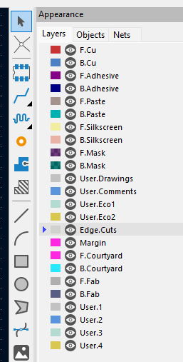
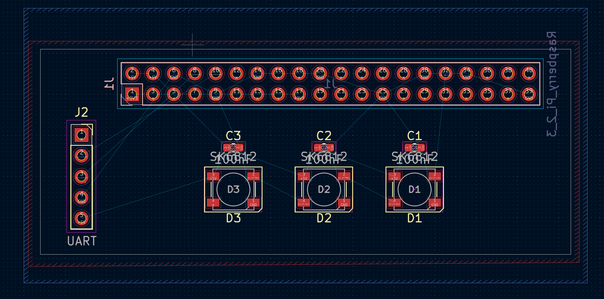

# PCB (KiCAD) Lab v2 by Parthiv

## Overview
This lab will be focused on designing printed circuit boards (PCBs), which many students in 140e/240lx/340lx have found useful over the years in final projects to help reduce wiring complexity and increase hardware reliability. The focus of the lab will be on how to replace a bundle of wires with an inexpensive PCB, and not on how to actually design electrical circuits (which is a much more complicated discussion). For the most part, you can get by just connecting breakout boards together. If you want to integrate a piece of hardware without a breakout board, most datasheets will include an "application circuit" that will show you what supporting hardware is needed.

Our goal is to create a board that can plug into the Raspberry Pi GPIO header and connect to a USB to UART converter along with some RGB LEDs. To extend the lab, you'll also add in connections to a few sensors/peripherals/hardware of your choice. 

## General Keyboard Shortcuts
I assume `Ctrl` becomes `Cmd` on mac.

* `Ctrl+S`: Save (do often!)
* `Ctrl+Z`: Undo
* `Ctrl+Y`: Redo

## Step 0: Prelab

Please review [PRELAB.md](./PRELAB.md). If interested, you can also check out a previous version of the lab [here](https://github.com/dddrrreee/cs240lx-23spr/tree/main/labs/16-pcb). In the original version of the lab, we focused on designing a board with NRF24L01 wireless transceivers. You can use that board for inspiration if you'd prefer to do something a little more "batteries included".

**A mouse will be very helpful!**

## Step 1: Creating a Project

1. Open up KiCAD (either type `kicad` in your terminal or search for it in your installed applications).
2. Go to File->New Project. Select a location where you want to create the project (you can do it in this directory) and give it a name. Ensure that the box to "Create a new folder for the project" is selected. Create the project.
3. You should see a window like this:

    

    On the left side, you can see a file called [project_name].kicad_pcb and another file called [project_name].kicad_sch. Double clicking these will open the PCB and Schematic editors respectively. We will learn what these are in more detail.

## Step 2: Creating a Schematic

1. In the main KiCAD window, double click the .kicad_sch file to open the Schematic editor. You'll probably get a popup saying that KiCAD is being run for the first time; just use the default option to "Copy default global symbol library table". Once that's done, you will see a blank schematic:

    

    The schematic is where we will describe what pins of what components connect to what other pins of other components. The analog here is your `.h` file. You'll definine the connections between components (like function interfaces) but not the actual physical implementation of those connections (like the function implementations in `.c`). You should try to keep this organized if you can! I will show you some strategies on how to do this. 

    You can middle click and drag to move, or scroll up/down to zoom. Ctrl+scroll will move you left/right and shift+scroll will move you up and down, if you prefer that to middle click and drag.

2. Go to Place->Add Symbol (or type the keyboard shortcut `A`). Again, if you get a popup here, "Copy default global footprint library". In the search bar, search for the symbol `Raspberry_Pi_2_3`. Select it, then click OK to start placing the component. Place it somewhere in the middle of the schematic by clicking. If you want to move it, you can click on it, hit `M`, and then move it around, then click again to place it. You'll immediately notice that the pins are laid out quite differently from the actual physical pins on the Pi. And you'll see just one GND, 5V, and 3.3V pin, though the Pi has many. This is one of the ways that we simplify the schematic view to make it a bit easier to see what's going on. In older versions of KiCAD, you may see all of the power pins represented; if so, you can just wire them all together in the schematic (see old version of the lab).

    

3. Now, we will connect the power rails of the Raspberry Pi. Hit `P` to open up the power symbol menu. Search for `GND`, select it, and hit OK to start placing the ground symbol. Put it near the bottom of the Raspberry Pi symbol. Hover over the end of one of the GND pins on the Pi, then hit `W` to start drawing a wire. Note that it'll start drawing a wire from wherever your mouse was; if it was in a bad spot, you can click `Esc` to cancel drawing the wire and try again. Connect the Pi's GND pin to the GND symbol you just placed.

    

    Next, add power symbols for `+5V` and `+3V3` to the schematic, and connect those to the 5V and 3V3 pins of the Pi.

    

4. Now that we've connected the power for the Pi, let's add the RGB LEDs. We are going to use the SK6812 LEDs, which are compatible with the more common WS2812 but work with the 3.3V logic level that the Pi outputs. Technically, WS2812 require 5V logic (though we often get away with 3.3V for small chains). You can review the SK6812 datasheet in [docs/SK6812.pdf](docs/SK6812.pdf). It's a pretty short datasheet and worth looking through the whole thing.

    In the schematic view, type `A` to add a new component, then search for `SK6812`. Place a few of them down (however many you'd like)! You can also just place one, click `Esc` to get out of the add component mode, then left click and drag to select the LED you placed, then Ctrl+C/Ctrl+V to duplicate it however many times. 
    
    Something to know is VDD (or sometimes VCC) in datasheets or component pinouts refers to the positive voltage, while VSS (or VEE) refers to ground.
    
    If you read the datasheet (read the datasheet!), you'll see that the manufacturer recommends placing capacitors between the 5V supply and ground near each of the LEDs. This is a pretty common thing you'll see to help provide a more stable voltage supply to more power-hungry components. Usually, they'll specify the capacitance properly (in pF, uF, or nF), but here you can see a 3-number code of `104`. A quick search will tell you that `104` is 100nF or 0.1uF. Let's add these capacitors too; the name in the parts menu is `C`.
    
    Go ahead and connect +5V and GND sources to each of the LEDs as required (type `P` to add power sources, `W` to draw wires). When drawing wires, if you click before reaching your destination, you'll get to decide where the wire turns in the schematic view which can be helpful for organization. It's common to just have a whole bunch of power sources all over the schematic to avoid drawing long wires between them. There is an implied connection between all sources with the same label. 

    Pro-tip: you can make one LED/capacitor/wires/sources unit and then copy/paste that a few times. 

    Apply the capacitance value to the capacitors by clicking on the capacitor, then typing `E` to edit. Then in the popup window, update the value in the `Value` field. This isn't enforced in any way, it's just a note so you know what it is when you're placing the capacitors on the PCB.

    

    Choose a Pi pin to connect the first LED's DIN port to. I chose GPIO12 (which is incidentally pin 32). Your schematic should look something like this:

    

5. Now, let's create a connector for a [USB/UART converter breakout board](https://www.amazon.com/MTDELE-CP2102-Serial-Adapter-Module/dp/B0D76NNWVW) so we can plug it directly into the PCB. Unfortunately, most breakout boards won't have an associated symbol in KiCAD, but it's good practice for creating new symbols. We'll want to create a symbol to represent the logical pins that the USB/UART has. Go to Tools->Symbol Editor. You will see a blank symbol editor like this:

    

    On the left, you can see various symbol libraries which contain different default parts that are common enough to be included in KiCAD. We will be creating a new one.

    In the symbol editor, go to File->New Library. If you make it Project, any parts you make will only be usable in the current project. If you make it Global, you can use it in future projects. I went with Project but either is ok. Give it whatever name you want (`cs340lx_pcb`, or something).

    On the left window, find the library you created and right click on it. Then click New Symbol, and you'll see a new window pop up. See below for recommended settings.

    

    Click on OK and create it. 
    
    On the left of the main window (to the right of the list of libraries), right click on the grid and select Edit Grids.

    

    In the window that shows up, change the Fast Grid Switching: Grid 1 to 100mil/2.54mm. This helps with alignment for placing pins in the symbol. Then close this window, and type `Alt+1` to switch to the 100mil/2.54mm grid. Make sure the bottom of the symbol editor shows `grid 100`.
    
    Now that setup is done, it's time to make the symbol. On the right side of the main window, select the Draw Rectangles tool and draw a rectangle on the screen. Don't worry, you can change it later. If you want to move the auto-generated text (`J`), you can click on it (press escape to reach select mode like in the schematic editor) and hit `M` to move it. Click to place.

    
    
    Now, we will add the pins. Hit `P` to create a pin. We'll make the `GND` pin, which is pin number 4 (4th from the top of the UART) and is a Power Output. The reason we choose Output is because the entire system's power/ground is going to be generated by the UART plugged into your computer.

    

    Place the pin down at the bottom of the rectangle, ensuring that the circle end of the pin is facing out (this is where you'll connect wires in the schematic). Click `R` to rotate the pin.

    

    Create the remaining 4 pins:

    - 1: 3V3, power output
    - 2: TX, output
    - 3: RX, input
    - 4: GND, power output (already did in step 11)
    - 5: 5V, power output

    Try to keep voltage at the top, ground at the bottom, and signals on the sides (like the Raspberry Pi symbol). You can grow and shrink the rectangle if needed by going to the select tool (escape) and then clicking on the border of the recctangle. Your symbol should look something like this (doesn't have to match exactly). You can rotate a pin with `R` and move with `M` like you'd expect.

    
    
    You can add text using the text tool on the right side. Once you've finished the UART symbol, save with Ctrl-S or Command-S, then exit the symbol editor. In the schematic editor, click `A` to add a symbol. Search for the UART you just created; you should see it pop up.

    

    Connect the 5V pin to your +5V rail, GND to GND, TX to the Pi RX and RX to the Pi TX. You can optionally connect 3V3 to +3V3, but this isn't strictly necessary since the Pi also creates its own 3V3 on the pins. I left it unconnected.

    By convention, if wires appear to cross but don't have a circle over the intersection, they are considered to NOT be connected.

    Hover over an unused pin on the Pi and hit `Q` to mark it as a No-Connect (looks like an X). This declares that you meant to not connect this pin and didn't just forget to connect it. Now, you're in no-connect placing mode and you can click on all the unused pins on the Pi/LEDs/UART/your custom hardware. Compare your schematic against the Completed Schematic section below, making sure that everything is connected the way it should be.

    

6. Create and add new symbols for your selected sensors of choice. If you used breakout boards, there should be very little/no additional supporting hardware and you should just be able to wire up to pins on the Pi. You can check datasheets or hookup guides to be sure. Feel free to ask Parthiv for help/confirmation. Make sure your pins are numbered correctly, which will make things much easier later on.

7. Annotate the schematic with `Tools->Annotate Schematic`. A window will pop up, click Annotate, which assigns reference designators (`C1`, `J2`, etc) to all the symbols. Click `Close`.

8. Now, go to `Inspect->Electrical Rules Checker` and click Run ERC to run the ERC. Make sure you annotate the schematic first; otherwise, you get a ton of weird errors. This is like a type checker in software; it will catch violations of electrical rules (type rules) but NOT correctness. And sometimes it rejects valid schematics (like a type checker can reject valid programs), which you will see.

    

    You will hopefully see 0-1 errors. If you connected the UART 3V3 to +3V3, you will not get the error I have. This error is because whoever made the Raspberry Pi Symbol decided to make the 3V3 pin a power input even though it's a power output. So the ERC thinks nobody is providing power to +3V3. We know this to be wrong (the Pi outputs 3V3) so we can ignore this.

    If you have other errors, address them and re-run ERC. A common error is forgetting to put a no-connect on a pin that is unconnected. Also, be careful with custom symbols that you properly assigned the pin types.

9. The last step is to assign footprints, which are the representation of each symbol in the real world PCB. Go to `Tools->Assign Footprints`, which will open a new window. 

    

    You will see that the LEDs have footprints already assigned. It's worthwhile to check the datasheet to make sure these are correct. We need to assign footprints for the other components. Click on the row with C1, then on the left side look for library `Capacitor_SMD` (capacitor, surface mount device). On the right side, look for footprint `Capacitor_SMD:C_0603_1608Metric`. This corresponds to a standard 0603 surface mount capacitor, which is a super common size. Double click on `Capacitor_SMD:C_0603_1608Metric`, which will assign that footprint to our capacitor.

    Go through and do this for all the components:

    - Both capacitors: `Capacitor_SMD:C_0603_1608Metric`
    - Pi: Library `Connector_PinSocket_2.54mm`, footprint `Connector_PinSocket_2.54mm:PinSocket_2x20_P2.54mm_Vertical` (0.1" female header, 2x20)
    - UART: Library `Connector_PinSocket_2.54mm`, footprint `Connector_PinSocket_2.54mm:PinSocket_1x05_P2.54mm_Horizontal` (0.1" female 90 degree header, 1x5).
    - Your selected breakout boards: probably a 2.54mm 1xN PinSocket for some N.

    Then click "Apply, Save Schematic & Continue". You can then close out of the Assign Footprints window and the schematic editor.

### Schematic Editor Keyboard Shortcuts

* `A`: add symbol
* `P`: add power symbol
* `Esc`: go to regular mouse (select) mode
* `M`: move (after selecting a symbol)
* `R`: rotate (after selecting a symbol)
* `E`: edit symbol properties (after selecting a symbol)
* `Q`: place no-connect symbol (should be in select mode first)
* `W`: draw wire (should be in select mode first)

### Schematic Editor Tools

* Tools->Symbol Editor: create new symbols
* Tools->Annotate Schematic: assign reference designators
* Tools->Assign Footprints: assign PCB footprints to schematic symbols
* Inspect->Electrical Rules Checker: validate against some rules

### Symbol Editor Keyboard Shortcuts

* `P`: add pin
* `Esc`: go to regular mouse (select) mode
* `M`: move (after selecting a symbol)
* `R`: rotate (after selecting a symbol)your Schematic 

## Step 2: Laying out the PCB

Time to create the PCB! For all of these steps, you don't have to match the exact thing I do. Actually better if you don't, so it's your board and not you making my board :D

1. From the KiCAD main window, double click the .kicad_pcb file to open the PCB editor. You will see a blank PCB, this time a black background instead of white (schematic).

    

    You can middle click and drag to move, or scroll up/down to zoom. Ctrl+scroll will move you left/right and shift+scroll will move you up and down, if you prefer that to middle click and drag.

2. Go to Tools->Update PCB From Schematic. This will open a window, click "Update PCB". You should do this any time you edit your schematic or assign new footprints in the schematic.

    Hopefully, there are zero warnings/errors. A common error is forgetting to assign a footprint to a symbol in the schematic. If you do this, then KiCAD is unsure what physical footprint to assign to the logical symbol you created in the schematic. Revisit step 19 from part 1 if this happens. Then, come back to the PCB viewer and this step again.

    If you have zero warnings/errors, then you can "Close" the window that popped up, and then click anywhere to place the mess of components.

    

    You will see a 2x20 pin header for the Pi, 1x5 header for the UART, LEDs, capacitors, and any additional headers/components for your chosen hardware.

    If you look at the picture at the very top of this page, you will see that the Pi header is on the underside of the board whereas everything else is on the top. To move the Pi connector to the backside of the board, click on it, then hit `F` to "flip" it to the back. You will see the outline change from pink to blue, and also the text related to the Pi header will be mirrored. 

    

    You can also go to View->3D viewer to see this, though there will probably be an error about not having a board outline yet (which we will fix shortly).

3. Now, we will try to organize the components reasonably well to minimize the length of the connections we need to make. Hit `Esc` to go to select mode, then click on any footprint. Once you've selected the footprint, you can rotate it with `R` or move it with `M`. Click to place when you're in move mode. 

    All of the thin lines you see connecting the different pins of components are connections we will eventually need to make, so trying to keep these as "untangled" as possible will make things easier. That being said, it's probably impossible to completely avoid crossing (it's not an issue to have crossing wires as we can route wires on the front and back of the board).

    I would recommend putting the Pi header at the top of the other components, with the +5V pads to the left. Then, put the UART near the left side of the Pi header (so there's a short path for +5V).

    Also, make sure to keep each capacitor close to the +5V pad of one of the LEDs. Technically, the way that our schematic is, we could connect them to anywhere on +5V and GND. However, we would like to keep the resistance on the path between the capacitor and the LED as small as possible, so that the capacitor can deliver power to the LED when it has current spikes when turned on bright. Here's one possible arrangement which is pretty reasonable:

    

    You'll see I assigned the wrong footprint for the UART (not a Horizontal/right angle header) so I went ahead and fixed that in the Schematic editor (Tools->Assign Footprints) then went back to the PCB editor and ran Tools->Update PCB from Schematic.

    If you're particular about alignment, you can select multiple components with Shift-Click and then right click. In the menu, select "Align/Distribute" and mess around till you get what you want. 

4. Now let's draw our board outlines. On the right side, you will see a bunch of Layers

    

    These each represent a different layer of the PCB. Some highlights:
    * `F` and `B` prefixes are for front and back, as we can have many things on either side of the board
    * `Cu`: front and back copper, which are where we make our connections. In a more-than-2 layer board, we will have `In1.Cu`, `In2.Cu`, etc.
    * `Adhesive`: some components are glued to the board, this layer shows where the glue should be placed
    * `Paste`: for surface-mount components, this is where the machine will automatically place solder paste. After components are automatically placed in their locations, the whole board is baked, melting the solder paste, then cooled, hardening the paste (and making electrical/mechanical connection with the components).
    * `Silkscreen`: text/drawings that are printed on the board for aesthetic/documentation reasons
    * `Mask`: The green (or other color) layer of the board which protects the underlying copper from corrosion and accidental shorts. It's expected that most of the board has mask, so the `Mask` layer is actually the negative. So it shows where there is _not_ mask.
    * `User.*`: these don't get printed, so you can put stuff for documentation
    * `Edge.Cuts`: the edges of the board which are cut.
    * `Courtyard`: bounding polygons for the various components. Ideally, no courtyards overlap so we can ensure that no components are inside each other. Just like we had an ERC in schematic, we have a DRC (design rules check) for the PCB which will complain if two courtyards overlap. However sometimes we know that we are safe (e.g. capacitor fits "under" NRF).

    You can enable/disable the visibility of layers by clicking the eye icon, which can be interesting. 

    You'll want to click on the `Edge.Cuts` layer and make sure the triangle is pointing to it (like in the image above). Select the rectangle tool (also selected in the image above). Now, draw a rectangle around the components you made by clicking once for one corner, then clicking again for the opposite corner. Give yourself some extra space for routing traces (wires) around the components. 

    

    Now, if you open View->3D Viewer, you will see your new outline.

    If you make it too big/too small, you can always edit this by clicking on the `Edge.Cuts` layer, then the select tool (`Esc`), then clicking on the corner of the rectangle and changing the shape. 

    You can also make a custom shape using a vector graphics tool like inkscape, then export as SVG. Then go to File->Import->Graphics and add your shape to the `Edge.Cuts` layer.

5. A common practice in PCB design is to make (almost) the entire front of the board be connected to your power rail, and (almost) the entire back of the board be connected to your ground rail (or vice versa). This helps you avoid having to manually connect every power and ground together, sort of like how we just connected them to the GND and +5V symbols on the schematic to avoid a ratsnest of wires between the power pins.

    We will do that now. Click on the `F.Cu` layer and do `Ctrl+Shift+Z` (mac may be `Cmd` instead of `Ctrl`) to open a window for "copper zone". Ensure that the `F.Cu` layer is selected on the left, then select the `+5V` net.

    

    Hit OK, then draw a rectangle that's bigger than the rectangle you drew for the edge cuts (this time, you need to click all 4 corners, not just 2 opposite). Repeat the process for `B.Cu` and `GND`. It should look something like this when you're done:

    

    If you mess up while you're drawing, you can hit `Esc` and try again.

6. Let's actually fill the zones to make the electrical connections. Hit `B` to fill zones. This should hopefully connect all of our +5V and GND connections for us! You'll see the connection lines for those disappear. If you zoom in to some pins, you will see what exactly happened:

    

    Notice that on the front side (red), where we made the 5V zone, KiCAD helpfully connected the pin with an X pattern. On the back side (blue), where we made the GND zone, KiCAD connected with an X pattern. It may be easier to see what's going on if you make one of the two copper layers invisible (see above). Make sure to turn it back on afterwards.

7. Now the fun begins: time to route our traces! Click on `F.Cu` on the left to route on the front of the board. Then, select a `1 mm` trace width. Move your mouse over the +5V pad on the UART (you can zoom with scroll wheel, and middle click+drag to pan). Hit `X` to enter trace mode. If you move your mouse, you will see a trace expanding out of the pad. 

    Each time you click in trace mode, you will "save" some of your progress that you've made. Once you reach your target, you can click on it to finish routing the trace. In general, try to avoid 90 degree turns. 

    Go ahead and connect the Pi pin you selected for the LED signal to the first LED. It's ok to go in between the pins of the Pi. Then, hit `B` to re-fill the zones, and you'll see a bit of the front +5V zone has been cleared out to allow the trace you just made to go through it. 

    
    
    Let's now route the other 2 UART connections. I started doing that, but it seems like my traces will have to cross!

    

    We have a few options on how to solve this. We can go all the way around with one of the connections.

    
    
    But you'll notice this cut off the Pi's +5V pins from the rest of the +5V zone, making an "island". KiCAD is drawing a short connection line between the main zone and the "island" to inform us of this. We could go ahead and connect this, but it's not ideal.

    We have two layers! We could, for example, just cross the signals by moving one to the back of the board. While routing one of the signals (with `X`), click `V` to enter Via mode, and then place the Via somewhere so you can swap sides of the board. Since the UART Module uses through-hole pins, it can connect directly on the backside to the backside trace. Surface mount components (like our LEDs and capacitors) can only connect on the side they're placed on, so you'd need another via to bring the signal back to the front.

    

    We can also just route the whole signal on the back of the board. If you're not currently routing any trace (`Esc`), then clicking `V` will swap you between the front and the back. If you're on the back, the board will appear blue. 

    

    This is a bit of a contrived/silly example, but hopefully it demonstrates that you have a lot of options available when routing more complicated netlists. You may have to experiment with different solutions to problems and backtrack if things get too complicated. An absolute worst case scenario is to go a 4-layer board. It just increases cost (though not by a lot if you are ok with all your vias going all the way through the board). Most projects you'd do should be routable on 2 layers.

8. Finish up routing the surface mount components. You'll notice that the GND pins on the LEDs and capacitors cannot connect to the GND plane on the back; this is because they are surface mount components and only connect to the front by default. Add vias for those, either by starting a routing with `X` and then hitting `V` to place a via, or by hitting `Ctrl+Shift+X` to place a via directly. After placing the via and selecting the GND net, you can then route.
    
    Finish up routing your custom hardware, then save (hopefully you've been doing this throughout). You can admire your work in the View->3D Viewer!

9. I would recommend adding some annotations on the Silkscreen. You can click the `F.Silkscreen` (or `B.Silkscreen`) on the right side, then the text tool, and add annotations. At the very least, it's good to write the pin names on the various connectors (or at least enough that you plug it in the right way). And label the different connectors if you have several.

    My completed base PCB:

    

10. Almost done with the board! Let's run DRC (design rules checker) which will make sure our board is manufacturable. Go to Inspect->Design Rules Checker. In the window that pops up, enable "Test for parity between PCB and schematic" just to be sure.

Click Run DRC. If you have errors, go to the DRC Errors section below for common errors. For each, I'd recommend you zoom in super close, then click the entry in the DRC window. You will see an arrow in the middle of your screen. Address the issue and then click Run DRC in the window again. If there are other errors, ask me and I can help you out. 

### Routing Tips

#### Clearance
Try to give clearance to pads and don't route traces too close to them (especially ones that connect to planes). This makes it easier in the future to route signals from those pads.

#### Try, try, try again

Don't be afraid to delete an old trace and re-route it if you find you need to move it to make something else work.

#### Zone Islands
An extremely common issue that people ran into was creating a filled zone "island", like below: 

 

Notice how the two traces have created an almost closed-loop, which cuts off a section of the filled zone into an island that's disconnected from the rest. An easy fix is to open the closed loop by moving one or more of the segments of the traces onto the other layer. If you go to the select mode (`Esc`), then click on a piece of trace, then hit `E`, then swap the layer to the other layer. You can then go and place vias (`Ctrl+Shift+V`, or `Cmd+Shift+V` for mac?) on each end of the segment that you flipped to the other side to make electrical connection.

Another (worse) solution is to to put a via on the island and off the island and route a "jump" on the other side of the board. This isn't really recommended though, since it means there is higher resistance on the power plane (vias introduce resistance).

### DRC Errors

Here are some common DRC errors/warnings

#### Track has unconnected end

You have some track that is only connected on one side and can just be deleted. A tricky one is when the track is contained entirely inside a pad hole, so it's invisible (see below). Just click on the exact tip of the arrow that is pointing out the error and it should get highlighted. Then just hit `Del`. It helps to be VERY zoomed in on the PCB editor window.

#### Silkscreen clipped by solder mask

You have silkscreen that is either drawn off the edge of the board, or overlaps a pad somehow. Either expand your board (go to `Edge.Cuts` layer, then `Esc` to select, then click and expand the rectangle). Or move the silkscreen item (go to appropriate `*.Silkscreen` layer, then `Esc` to select, then click item, then `M` to move it). Below you can see I drew my board too small so the silkscreen hangs off the edge.

### PCB Editor Keyboard Shortcuts
* `Esc`: go to regular mouse (select) mode
* `M`: move (after selecting a footprint)
* `R`: rotate (after selecting a footprint)
* `F`: flip footprint (after selecting a footprint)
* `Ctrl+Shift+Z` (or `Cmd+Shift+Z` on Mac?): create filled zone
* `B`: fill zones
* `X`: route trace
* `V`: swap active copper layer (front to back or vice versa)
* `Ctrl+Shift+V` (or `Cmd+Shift+V` on Mac?): create via
* `E`: edit properties
* `Ctrl+Shift+T` (or `Cmd+Shift+T` on Mac?): add text (in silkscreen layer)

### PCB Editor Tools
* Tools->Update PCB From Schematic: Apply any updates from the schematic editor (make sure to save in schematic editor)
* View-3D Viewer: view a 3D model of your board
* Inspect->Design Rules Checker: validate that it's manufacturable

## Step 3: Manufacture the PCB

Coming soon. If you get to this point and it's not ready, refer to a previous lab. I just need to dry run and make sure that everything is still the same. 

## Step 4: Extensions

Here are some ideas for extensions.

1. Rather than using a CP2102 breakout board, look up a datasheet and place your own CP2102 chip and all of the various supporting components so you can plug a USB cable into your PCB and talk UART with your Pi. You can also check out the included `parthiv_pcb_v2.1` project which will contain a sub-schematic for the CP2102N and supporting hardware. You can copy this schematic into your project and import it, though it's a good exercise to build it from a datasheet. 

2. You can also do the same with any raw part that you selected, which will often be much cheaper than doing it with the breakout for volume production. However, I would always suggest having the breakout board as a backup option to help you determine if bugs are software-related or hardware-related. Check out JLCPCB parts to see what's available for manufacturing.

3. Create some interesting artwork and integrate it into the board shape, silkscreen, and/or component layout of your board.

4. Use the [KiCAD python API](https://gitlab.com/kicad/code/kicad-python) to programatically define aspects of your layout. For example, you can place a bunch of LEDs into a grid.

