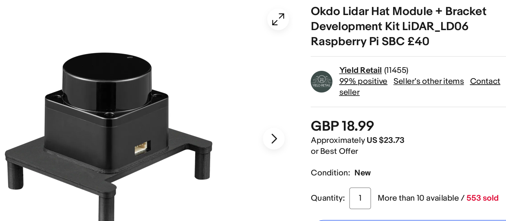
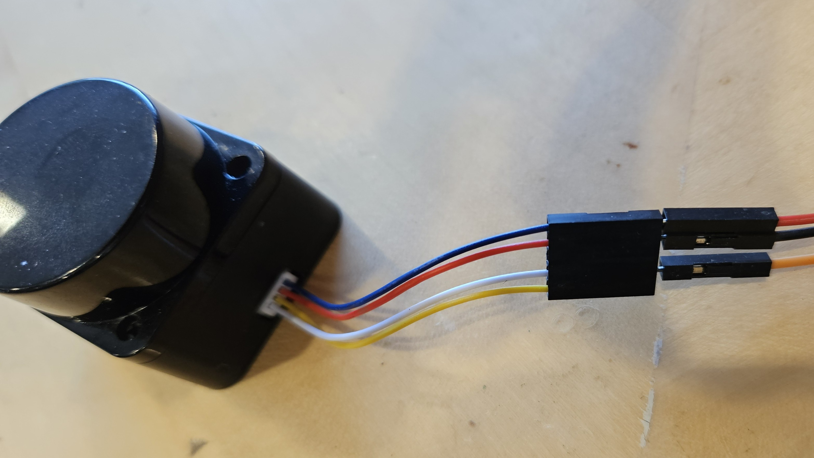
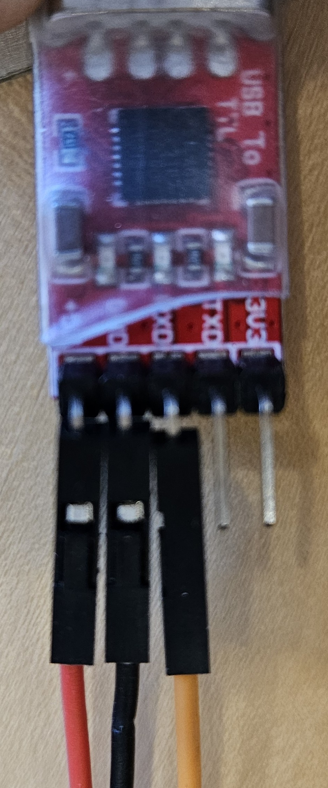

### Quick lidar lab (do it with 3-hdmi!)

As promised, we get fancier devices than 240lx.  Today's is the okgo ld06
lidar!    From the datasheet(s):
    - anging core operates at 4.5 kHz (4500 measurements per second)
inno-maker.com
inno-maker.com
. The LiDAR outputs roughly 480 distance points per full rotation (approx. 12 points per 7.2° data packet, see protocol below).

  - The LD06 spins a class 1 laser to do (relatively) precise, low-latency
    scanning of 360 degrees around the unit.  It generates 4500
    measurements per second, roughly 480 points per full rotation.

  - It requires minimal configuration: it starts spitting out data
    using UART at 230,400 baud.  
  - The various datasheets have the packet structure.

We are doing a James and Sai style open-ended lab: 
  - You get the device.  
  - You don't get much else (so won't have to read code or prose :).
  - There are a few datasheets in the [datasheets](datasheets/README.md)
    directory.  (These might not be the best so add any others you 
    find to 340lx-contrib and I'll pull them over.)
  - Do something with it!

#### Checkoff

What to do:
  1. `lidar-cat/`: this is a simple driver that runs on Unix.
     It should be easier to debug than on your pi.

     Hook up your lidar to the tty-serial device we gave out in class and
     make sure your lidar spits out data.  Then write a packet decoder
     and see that it makes sense.  (E.g., maybe spit out the min reading
     every 1 sec or so to make it easy to debug.)

  2. Display the lidar results on your pi's HDMI screen.

     Port your decoder over to the pi.  Use software UART
     to pull the data and display the points on your screen.
     Maybe color code them with a color that drifts over time
     or coded by rate of change (red for regions with movement).

  3. You do something cute with it over the weekend, report back on tues
     (assuming things go well).

----------------------------------------------------------------------
### Step 1: Hooking up the tty-serial on Unix

    
    

The first thing we do is get the readings on Unix.
Why:
  1. Can write the decoding logic on unix, which is a bit
     more forgiving.
  2. Can adapt this code and use the lidar in a unix program
     (e.g., to do screen animations on your laptop etc).

How: 
  - Connect the lidar to a tty-serial device.
  - Adapt the `my-install.c` code from the bootloader lab to read
    from the `/dev/` mount point.
  - Why: Most people use "screend" to interact with ttyUSB devices, 
    but (1) "screend" is annoying and (2) you can't pull its
    results into computation (eg decode the packets)
  - Later you can use variants of this code to program a bunch of 
    different tty-usb devices.

You should hook the tty-serial up using only three wires:
  1. RX
  2. 5v.
  3. GND

when you plug it in, you should be able to see blue lights on the top of
the LD06.  When you run `lidar-cat` as-is it should start spitting out
garbage looking values (since we are echoing raw binary to the screen).

What to do:
   - Go through the datasheets and write a packet decoder and see
     that the values make some sense.

Note: 
  - You will have to find the start of each packet.  This has some
    mild ugliness since the packet sentinel could also appear in the
    packet data.  So (ideally) you probably want to find an alignment 
    that gives you multiple packets in a row.  Likely it's more 
    natural to read a large a chunk as possible.  
  - Additional complication: if you don't get the data quickly enough,
    presumably your OS will start dropping packets (definitely your
    pi will!).

----------------------------------------------------------------------
#### Step 2: draw on your pi hdmi screen!

For this:
  1. Convert your packet decoder to run on the pi.
  2. Display the results on HDMI.
  3. Optional: use device interrupts so you don't drop stuff.

----------------------------------------------------------------------
#### Step 3: do something cute!

We are experimenting with making labs more open ended.  So today's
experiment: use the LD06 to do a cute micro-project.  The bigger it is,
the more extra/extension credit you get.  (Possibly can just flip out
into a final project.)

Some OS ideas:
  - Adapt your fast code from lab 1 to make a circular buffer
    of UART data so you can do something else while reading data.
    (We'll probably do this in the next week or so.)

Some visual ideas:
  - Adapt `lidar-cat` so that you can display on your laptop.  
  - Make a movement reactive picture on your screen that distorts
    based on position or variance.
  - Use your stepper motor to follow where the lidar detects movement.
    (Joseph style: Put something dangerous on it?)
  - If you have speakers from 240lx: Use the lidar to create a theramin.
    It provides a very rich set of input data that should make
    interesting noise.
  - Use the lidar to control a square on your screen.
  - More general: Some kind of video game?
  - Does it have enough resolution to do 3d scanning if you
     rotate an object using your stepper?
  - ???

