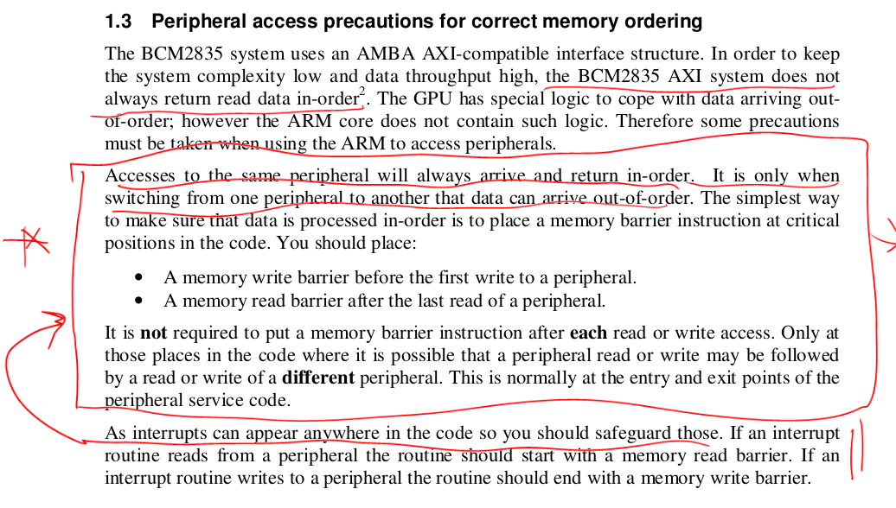

## Some very surprising memory ordering bugs.

Since I assume everyone is either tired from doing their midterm project
or still doing it before today's presentations, today's lab is a quick
but startling side-quest lab on memory ordering that came up over the 
weekend.  Some of the results were starling enough that I was mass 
texting screenshots to more people than are in the class :)  Hopefully
is interesting.

(Too-much) Context (feel free to skip):
  - While my group published some AI bug finding papers about two decades
    ago (some with Andrew Ng of all people!), until recently I've been
    an aggressively negative LLM cynic.  First, b/c it's such a fad and
    there is a ton of cringe work.  Second,  b/c of many of the people
    involved couldn't write "hello world" if they were given both "hello"
    and "world".

  - However, I finally found a use for it --- extracting datasheets (along
    with their rules) for undocumented hardware from all the ad hoc
    online sources that contain such information:

     - Linux kernel code, mailing lists and commits; 
     - BSD kernel
     - the Circle bare metal library (thanks Andrew)
     - all the bare metal online forums.
     - all the bare metal githubs
     - blogs such as iosoft
     - ...
    
    The fact that we don't have docs for the majority of devices on the
    pi has always been a real irritant, but it was so hard that we just
    lived with it.  I definitely wasn't going to try to reverse engineer
    from kernel code, but --- with the right prompts (key) --- LLMs can.
    
    The results have been so useful that I blew through all the tokens
    I had for all the paid LLMs I had access to.  Useful enough that
    during class Thursday I started paying Claude $100/month.

    I have a bunch of results on this if you're interested.

  - However, you can also use the same approach for hardware that you
    do have datasheets for and you think you understand.  Datasheets
    are notoriously incomplete, have errata, and are often unclear
    (their lack of examples and passive-definitional voice being two
    near-universal sins).  And understanding often has the same 
    problems.  If you are wrong: how do you know?  Hardware is hard
    to test.  You often don't know what you don't know.
    
    You can, obviously, use the same sources of information to fill
    in the blanks in both the documentation and your understanding.

    And, with the right prompts, it turns out you can find extremely basic
    stuff that hundreds of some of the best people here have missed for
    many years.  I was certainly surprised at what came out about the
    bcm2835 and while I'm more stupid than I was when younger, I have
    been thinking about that hardware and teaching based on it for years.

tl;dr:
  - Using specialized LLM prompts some weird stuff about memory barriers
    came out with simple examples.
  - We'll do some today, since it's startling we did not understand them
    (though obvious in retrospect)
  - The issues aren't specific to the pi we use, and should be generally
    applicable.  This is especially true for many RISC-v boards (please
    try!)  and likely there are even more bugs since their documentation
    is much worse, less battle-tested, and the chip fabs likely cut
    more corners.

### Background: The rules

<p float="center">
    
</p>

Recall the memory ordering rules from the bcm2835 document:

  1. A memory write barrier before the first write to a peripheral
  2. A memory read barrier after the last read of a peripheral.
  3. In an interrupt handler: since it can occur anywhere, start
     with a memory read barrier and end with a memory write barrier.
  4. Note, however, as they state: "it is not required to put a memory
     barrier instruction after each read or write access [to the same
     device]"

Where a memory barrier can either be:
  - DMB, which (roughly) ensures memory operations before the DMB have 
    been issued and memory operations after the DMB have not.   So for:

        str r0, [A]
        dmb
        str r1, [B]

    we are guaranteed that the store to A has been initiated before the
    store to B.  (Note: this does not guarantee they are complete and
    written all the way to main memory.)

    For the broadcom: reads and writes to the same location

  - DSB, which ensures memory operations and their effects *complete*
    before completing.  If you recall from the crazy memory coherence
    lab we did in 140e, we used DSB's when we wanted to make sure that
    hardware changes --- such as flushing a TLB, modifying the page table,
    flushing the data cache --- completed fully (not just got initiated)
    before continuing. Completion is important for expensive operations
    (e.g., cache flushes) where the hardware doesn't necessarily block
    until they are done.

Seems fairly simple, and our heuristic has always been: 

  - Just put a memory barrier when switching from one peripheral to 
    the next.  For example, when using GPIO and switching to SPI.


It turns out this is very much not sufficient!   
  - The distal problem: Just  because you have *issued* a device write,
    it does not mean that write has *completed* when you do the next
    device access.

To reword: Doing a store to a device register does not mean that the
potentially very costly action the store triggers has finished by the
time you do the next load or store to the same device.

If this doesn't make sense: recall that our stores and loads to devices
are a lie --- we aren't actually storing or loading memory.  It's more
accurate to view it that we are doing a remote procedure call using a
network packet across a funny network (a memory bus).  And, of course,
these procedure calls can take a long time.

We'll do a few examples below.  And hopefully you can think of your 
own and do them (ideally on another SBC!).

The high bit on the examples were that I didn't think any of them 
were problems, and yet they are.

In fact, I wager almost all drivers have at least one of the bugs below,
though they are likely hidden because the code is so slow that enough
cycles pass so the issue doesn't show up.


-------------------------------------------------------------------
### 1. Writing GPIO output then reading GPIO input: not sequentially consistent.

Given:
  - `out_pin` configured as output, `in_pin` configured as input;
  - `out_pin` connected to  `in_pin` using a jumper

If you run the following code:

```c
        gpio_set_on_raw(out_pin);
        if(!gpio_read_raw(in_pin))
            nerr_set++;  // Should be high but read low!

        // Set low
        gpio_set_off_raw(out_pin);
        if(gpio_read_raw(in_pin))
            nerr_clr++; // Should be low but read high!
```

You will get errors.   

This example came after I spent a bunch of time messing with LLM prompts
to give examples of how missing memory barriers gave errors.  The code was
simple and so against what we've believed that my immediate reaction was
"There is no way that this is a bug.  I've been wasting the past week.
This is such an obviously stupid hallucination."

But, when I ran it, it was a bug.

Crazy.


My test driver would call the test routine twice, two times with icache
off, two with icache on:
```
no cache: N=1000, set errors=0, clear errors=1000
no cache: N=1000, set errors=1, clear errors=1000
cache: N=1000, set errors=241, clear errors=511
cache: N=1000, set errors=998, clear errors=533
```

As expected, with the icache one we can run faster so are more likely
to see the old stale value.

Note:
  - you'll have to use inlined GPIO routines (you have these from lab 1).
  - To make sure you have consistent results: make sure you handle
    code alignment (recall: prefetch buffer fetches 32-bytes of machine
    code, aligned to 32-bytes).
  - Not crucial (I didn't do this) but I believe: as with lab 1,
    since printk is huge, you can reduce conflicts (and get more errors)
    by pushing the printing after all the code runs or by prefetching
    the instructions.


-------------------------------------------------------------------
### 2. Adding memory barriers is *faster* than no memory barriers.

Use the same setup as above.  Measure the cost of the following 
three code snippets:

  1.  No barrier.

```c
        gpio_set_on_raw(out_pin);
        while (!gpio_read_raw(in_pin));
```

  2. DMB

```c
        gpio_set_on_raw(out_pin);
        dmb_raw();
        while (!gpio_read_raw(in_pin));
```

  3. DSB

```c
        gpio_set_on_raw(out_pin);
        dsb_raw();
        while (!gpio_read_raw(in_pin));
```


How much faster are 2 and 3 compared to no barriers?  For my code:
```
COMPARISON:
  No barrier: 130 us (baseline)
  DMB:        79 us (39.230770% improvement)
  DSB:        79 us (39.230770% improvement)
```
I never would have thought *adding* barriers would speed up code. 
  - NOTE: Might be part of the reason that lab 1 had some weird speedups.

The current belief is that they force the values to be written out rather
than sitting in the arm1176's write buffer.  The sooner they are written
out, the sooner they change the GPIO pad and thus the read back value.

Note, as before to maximize the error:
  1. Make sure all the calls are inlined and what is being
     measured always the same good alignment.
  2. Enable the i-cache.
  3. For this code I did do the change suggested in part 1: put the printing
     after all my measurements and used instruction prefetching:

```c
#include "asm-helpers.h"
cp_asm_set(prefetch_icache_mva, p15, 0, c7, c13, 1)

static void prefetch_inst(void *start, void *end) {
    assert(start<=end);
    uint32_t s = (uint32_t)start & ~0b11111;
    uint32_t e = (uint32_t)end & ~0b11111;
    for(; s < e; s += 32)
        prefetch_icache_mva_set(s);
    prefetch_icache_mva_set(s);
}
```


-------------------------------------------------------------------
### 3. Device configuration is not guaranteed to complete before use.

We:
  1. Configure devices (GPIO, UART, SPI etc) using loads and stores to
     the memory associated with that device.
  2. We then use the device by doing loads and stores to the same 
     device memory as (1), though generally to different device memory
     offsets.

By straightforward reading of the BCM2835 documents:

  - Again: as they state: "it is not required to put a memory
    barrier instruction after each read or write access [to the same
    device]"

After configuration (1) we should be able to immediately (2) use the
device without a memory barrier since it this use will be a load or
store to the same device memory.

As you are probably starting to realize from the first two examples,
this is not true!   Just because 
  1. We have *initiated* the loads/stores to configure a device.
  2. *And* we are *guaranteed* the subsequent load/stores to use it
     initiated after (1).
  3. There is in fact *no guarantee* that (1) is *complete* before (2).

Simple example:

  0. Setup a GPIO pin P as output, write a 0: make sure when you 
     from from it using loopback you get a 0.
     This is no speed critical.
  1. Now set GPIO in P as input: do dsb so you are sure it is input.
     This is no speed critical.
  2. Finally, the punchline:  
      - In two instructions, change to output and write a 1.  
      - Do a DSB so you know it has completed.
      - Read the input pin.   Count as an error if it is still 0.

How many errors do you get?

-------------------------------------------------------------------
### 4. Do some other error example

Even better if you can do on another board.  I'm very very very curious!
