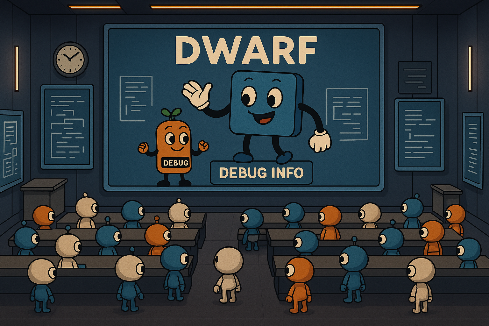
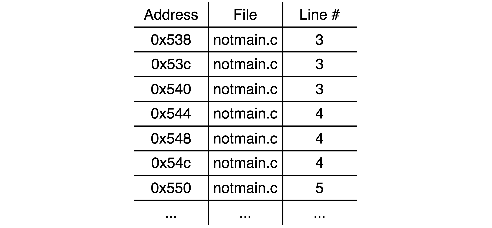
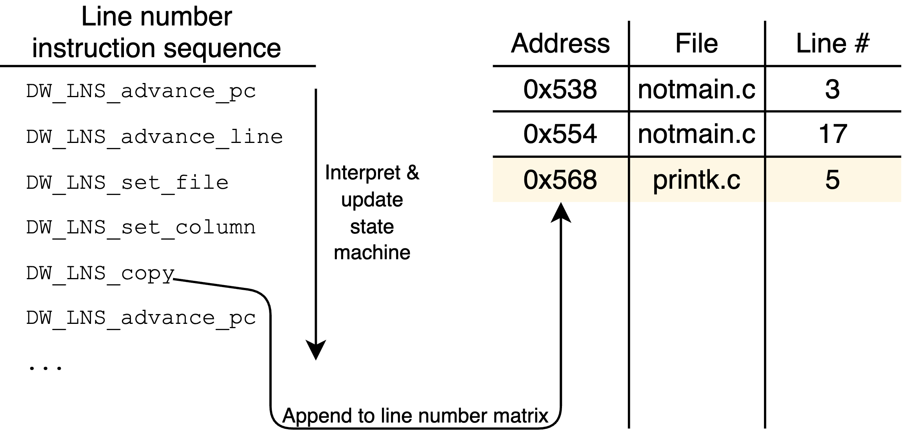
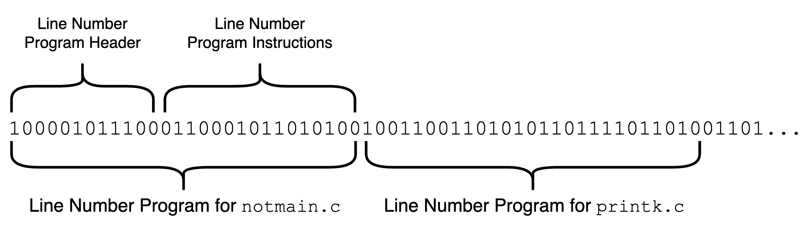

# DWARF Debugging Information Format (*Lab by Stuart Sul*)



Remember the [CS240LX: ELF and Dynamic Linker Lab](https://github.com/dddrrreee/cs240lx-25spr/tree/main/labs/15-elf-dynamic-linker) 🥹? In that lab, we loaded an entire ELF binary file into memory, manually parsed its ELF header, program header, and section header, and then jumped around many ELF sections. Through this, we ultimately transformed our Pi-side bootloader into a fully functional ELF32 dynamic loader and linker. That was pretty fun (at least to me 🙃).

While dynamic loading and linking required us to fully understand and manually parse most ELF sections (e.g., `.text`, `.rodata`, `.data`, `.bss`, `.strtab`, `.got`, `.got.plt`, `.symtab`, `.dynsym`, `.dynstr`, etc.), there were a few sections we deliberately ignored. Most of these omitted sections belong to the **[DWARF Debugging Information Format Standard](https://dwarfstd.org/)**, which provides runtime-accessible debugging information.

In today's lab, we focus on these previously ignored DWARF sections. We’ll build our own DWARF parser, specifically focusing on parsing the `.debug_line` section, that can extract various debugging information of a binary at runtime. This will uncover what modern source-level debuggers actually do: how they set breakpoints, print the current file name and line number, and much more. It also allows you to implement a wide range of powerful features. For instance, you could build your own custom GDB-like debugger from scratch (which was my final project for CS240LX)! Consider this as the **ELF lab, part 2**. Again, it’s going to be a lot of fun! 🥳

**Check-off: Finish parts 0, 1, 2, and 3**

## Recap 1: How We Run Programs on Our Raspberry Pi

Throughout CS140E, CS240LX, and CS340LX we've been statically linking everything, and passed the raw instructions to our Pi through our bootloader. If you've been paying attention to the Makefiles we use in the labs, you could've seen that the process is roughly:

1. Compile all the source codes under `./libpi` directory and whatever lab directory you are in with `arm-none-eabi-gcc` ➡️ this produces individual object files (`*.o`), which are ELF files
2. Link together all the object files created under `./libpi` into a static library with `arm-none-eabi-ar` (archiver) ➡️ this produces `libpi.a`, a collection of ELF files
3. Link together `libpi.a` and all the object files created under your lab directory into an executable with `arm-none-eabi-ld` (linker) ➡️ this produces an executable (ex. `my-test.elf`), also an ELF file
4. Strip away all ELF/linker metadata and only keep the raw `.text`, `.rodata`, and `.data` sections from the above ELF executable with `arm-none-eabi-objcopy -O binary` ➡️ no longer an ELF file 😥 we send THIS to the pi-side bootloader, which loads the binary into memory and jumps to 0x8000

In the [CS240LX ELF and Dynamic Linker Lab](https://github.com/dddrrreee/cs240lx-25spr/tree/main/labs/15-elf-dynamic-linker), we built our own ELF parser and dynamic loader/linker to skip step 4 and execute an ELF file as-is. This allowed us to overcome several limitations of the earlier CS140E approach: redundancy between the executable and our bootloader, inability to directly run ELF files, inability to use shared libraries, and the need to always statically link everything. 

Our goal today is also something similar: we preserve the compiled ELF binary format, and parse it to extract various debugging information.

## Recap 2: Executable and Linkable Format (ELF)

ELF is the standard binary format on many Unix-based and Unix-like operating systems. As its name suggests, it is used to represent executable files (ex. `my_program`), as well as object code (ex. `my_program.o`) and shared libraries (ex. `libpi.a` or `libc.so`). Why use a common format for binaries instead of directly writing machine instructions to binary files? Portability. The operating system can use ELF headers to determine how to parse different types of binaries, or to reject a binary as uninterpretable based on its metadata. ELF metadata also provides other useful information, such as the binary's endianness and its entry point (the address where the OS should begin execution of the program).

The basic structure of an ELF file is fairly simple; it consists of **4 main parts**:

```plaintext
    ----------------------------------
    |            ELF Header          |
    ----------------------------------
    |      Program Header Table      |
    ----------------------------------
    |           Sections             |
    |  (.text, .data, .symtab, ...)  |
    ----------------------------------
    |      Section Header Table      |
    ----------------------------------
```

Here's a more fancy, detailed diagram:


The **ELF Header** is the first component of an ELF file and contains general metadata such as the magic number, architecture (e.g., x86 or ARM), address size (32-bit or 64-bit), endianness, entry point address, and offsets to the program and section header tables.

The **Program Header Table** describes how to load the ELF file into memory. Each entry in the program header table corresponds to a *segment* and tells the loader which parts of the file should be mapped into memory, where in the virtual memory space they should be loaded, what permissions they require (read, write, execute), and their size in the file and in memory. This table is essential during runtime but not during compile-time. 

If we were being really precise, we would use the Pi’s virtual memory system to map segments and enforce access controls according to the program header table. This is useful because it allows us to avoid loading unnecessary parts of the ELF binary (e.g., `.symtab`), prevent execution of non-executable segments, and etc. But as we did for the previous ELF lab, *we ignore the program header table*.

**Sections** are the actual contents of the binary: code, data, symbols, relocation information, debugging information, and much more. Common sections include `.text`, `.data`, `.bss`, `symtab`, etc.

The **Section Header Table** describes each section in the ELF file: section name (e.g., `.text`), type, memory address, size, and offset in the file. This is what you use to actually locate the individual sections. It is mainly used by linkers and debuggers.

Our workflow with ELF for today is fairly simple:

1. Read the ELF header ➡️ We verify that the file we are reading is in fact an ELF file and locate the section header table.
2. Read the section header table ➡️ We locate the sections we are interested in (specifically, `.debug_info`, `debug_abbrev`, `.debug_aranges`, `.debug_line`, `.debug_str`, `.debug_frame`, `.debug_loc`, and `.debug_ranges`).
3. Read each debugging information section ➡️ We extract whatever debugging information we need.

## Background 1: DWARF Debugging Information Format

DWARF is a widely used, standardized debugging data format originally developed alongside ELF, though it is independent from it (i.e., an ELF binary may have sections of different debugging formats, or DWARF may be part of a non-ELF binary file). Its name, chosen as a medieval fantasy complement to “ELF,” has no official meaning. It is designed for source-level debugging, is architecture-independent, and is extensively used across Unix, Linux, and other systems. A good introductory writing is provided under `./docs`: [Introduction to the DWARF Debugging Format](./docs/DWARF_intro.pdf).

But why do we need this complicated specification anyway? Because the debugging information required to realize applications like `gdb` is **too large to pack in an executable**. This is precisely why we have DWARF. As you go through today's lab, you'll realize that every DWARF specification is an effort to compress whatever information we need (e.g., source file name given a machine instruction address) into as few bytes as possible.

In practice, DWARF consists of a collection of ELF sections embedded within an ELF binary (although the two formats are independent as mentioned above). The compiler does an amazing job behind the scenes to generate these, but we are not interested in their generation; we want to understand their structure and purpose. The DWARF sections we commonly see are:

* `.debug_info`
* `.debug_abbrev`
* `.debug_aranges`
* `.debug_line`
* `.debug_str` 
* `.debug_frame`
* `.debug_loc`
* `.debug_ranges`

You can find detailed explanations of each section in the documents under `./docs`.

Unlike ELF, which has a coherent structure where every component fits neatly together, DWARF sections are largely independent. For instance, in our setup, `.debug_info` uses DWARF 4 specifications, `.debug_line` uses DWARF 3, and `.debug_frame` uses DWARF 2! 🤯🤯🤯 This caused me a big frustration while working on my final project for CS240LX: just when I thought I had mastered DWARF 4, I realized I needed to read through another 500 pages covering versions 3 and 2.

Furthermore, although there are some light dependencies between sections, each one generally provides a self-contained piece of debugging information. To make things more challenging, every section has its own distinct and complex format, making them far from trivial to parse. Writing code to handle them is, frankly, hard (unless you are Max).

That is why, for today’s lab, **we’ll narrow our focus to a single debugging information section: `.debug_line`**. It’s the one I personally find both the easiest to understand and the most fun to explore.

## Background 2: Line Number Information (`.debug_line` Section)

Pages 92–104 of the DWARF 3 specification (6.2. Line Number Information) describe what the `.debug_line` section contains and how it should be parsed. The following paragraphs summarize the key ideas.

The primary purpose of the `.debug_line` section is to provide a mapping between machine instruction addresses in the executable and their corresponding source file names and line numbers. With this mapping, a debugger can display source locations, implement source-level stepping, set breakpoints, and perform many other tasks.

If memory usage were NOT a concern, providing this mapping would be trivial: a massive matrix with one row per machine instruction and columns for the source file name, line number, column number, and any other metadata needed. However, such a table, as shown in the below figure, would be impractically large.



To solve this, the `.debug_line` section encodes the mapping as a hypothetical state machine driven by a set of predefined instructions. When interpreted, these instructions reconstruct the "line number matrix" described in the previous paragraph. In other words, parsing the `.debug_line` section means implementing an interpreter for this state machine according to the DWARF specification, executing its instruction stream to rebuild the full mapping from addresses to source files and lines. This is depicted in the figure below:



In practice, the `.debug_line` section is a binary blob like any other ELF section. It consists of N contiguous sub-blobs, where N is the number of compilation units (i.e., the number of source files). Each sub-blob is called a **line number program**, defined by the specification as “a series of byte-coded line number information instructions representing one compilation unit.” This is illustrated in the figure below:



By interpreting one line number program, you can reconstruct the line number matrix for a single source file. Processing all of them gives you the complete mapping for the entire binary.

Each line number program has two parts: a **header** and a **sequence of instructions**.  
- The **header** contains metadata such as the program length, DWARF version, file name strings, and predefined constants that help compress repeated data.
- The **instructions** form the executable portion of the line number program. Interpreting them drives the state machine: modifying its state, resetting it, or appending new rows to the line number matrix.

## Part 0: Compile the ELF Executable Files and Move Them to Your SD Card (3 min)

**Check-off:**
- Run `make` inside `0-my-libpi` and `0-my-tests`, in that order.  
- Copy the resulting ELF files from `0-my-tests` to your SD card.  
- Open the `*.elf.readelf` files and locate the debugging information sections.

Just as in the previous ELF lab, it’s 😡😡😡 to repeatedly move files between your host machine and Pi. So we’ll move everything we need now, leaving the SD card in place for the rest of the lab.

First, we want our ELF executable binaries to be consistent across environments for a smooth experience. Instead of relying on each person’s individual `libpi` directory, this lab provides a dedicated `0-my-libpi` directory that all later builds will depend on. Unlike in the previous ELF lab, we won’t create `libpi.so` or perform dynamic linking. Instead, we’ll generate a static library archive `libpi.a` for linking later. This step might seem unnecessary, but it helps avoid subtle issues caused by differences in individual setups. Go ahead and run `make` inside `0-my-libpi`. This should produce a `libpi.a` archive; no further action needed here.

Second, `cd` into `0-my-tests`. This directory contains three programs that we’ll compile as full ELF executables, copy to the SD card, and later parse debugging information. We won’t actually run these programs in today’s lab (though that would be a great extension, and a necessary step to creating your own `gdb`). Instead, our DWARF parser will read these binaries directly from the FAT32 filesystem, parse their debugging sections, and extract metadata such as which machine instruction address corresponds to which line in the source code. Run `make` inside `0-my-tests`, then move all `*.elf` files (`test-0.elf`, `test-1.elf`, and `test-2.elf`) to your SD card. Before ejecting, run `sync` to ensure all data is properly written to disk.

Finally, let's take a look at the sections we’ll be parsing today. After compiling inside `0-my-tests`, open one of the generated `*.elf.readelf` files in `0-my-tests`. These are the outputs of running the `readelf` tool on your ELF executables. For instance, `test-0.elf.readelf` should look something like this:

```plaintext
Section Headers:
  [Nr] Name              Type            Addr     Off    Size   ES Flg Lk Inf Al
  [ 0]                   NULL            00000000 000000 000000 00      0   0  0
  [ 1] .text             PROGBITS        00000500 000500 000a40 00  AX  0   0  4
  [ 2] .rodata           PROGBITS        00000f40 000f40 0000f5 00   A  0   0  4
  [ 3] .data             PROGBITS        00001038 001038 000004 00  WA  0   0  4
  [ 4] .got              PROGBITS        0000103c 00103c 000008 00  WA  0   0  4
  [ 5] .got.plt          PROGBITS        00001044 001044 00000c 04  WA  0   0  4
  [ 6] .bss              NOBITS          00001050 001050 000008 00  WA  0   0  4
  [ 7] .debug_info       PROGBITS        00000000 001050 006d92 00      0   0  1
  [ 8] .debug_abbrev     PROGBITS        00000000 007de2 0017e2 00      0   0  1
  [ 9] .debug_aranges    PROGBITS        00000000 0095c4 000160 00      0   0  1
  [10] .debug_line       PROGBITS        00000000 009724 00129c 00      0   0  1
  [11] .debug_str        PROGBITS        00000000 00a9c0 000b86 01  MS  0   0  1
  [12] .comment          PROGBITS        00000000 00b546 000079 01  MS  0   0  1
  [13] .ARM.attributes   ARM_ATTRIBUTES  00000000 00b5bf 00002b 00      0   0  1
  [14] .debug_frame      PROGBITS        00000000 00b5ec 000400 00      0   0  4
  [15] .debug_loc        PROGBITS        00000000 00b9ec 0006af 00      0   0  1
  [16] .debug_ranges     PROGBITS        00000000 00c09b 000060 00      0   0  1
  [17] .symtab           SYMTAB          00000000 00c0fc 0008a0 10     18  88  4
  [18] .strtab           STRTAB          00000000 00c99c 000306 00      0   0  1
  [19] .shstrtab         STRTAB          00000000 00cca2 0000c1 00      0   0  1
```

If you recall the previous ELF lab, we had to parse several of these sections to understand the ELF file structure and handle dynamic linking. These included `.text`, `.rodata`, `.data`, `.bss`, and `.strtab` for normal program execution, as well as `.got`, `.got.plt`, `.symtab`, and various dynamic sections (which are not generated here since our binaries are statically linked) for dynamic linking.

However, we didn’t see any of the `.debug_*` sections back then. Why are they present now? In the ELF lab, we passed the `--strip-debug` flag to the linker, which removed all debugging information. In this lab, we’ve kept those sections intact. They contain debugging metadata about the executable, and our goal is to parse them to extract that useful information!

## Part 1: Load the DWARF Sections into Memory

**Check-off:**
- Fill in `dwarf_sections_init(...)` in `my-dwarf-loader.c`.
- Run `notmain.c` and pass the checkoff.

**TL;DR: Read through `notmain.c` to understand the program flow. Fill in the `todo`s in `my-dwarf-loader.c`**

Now that all ELF executable files are on the SD card, it’s time to start reading them 😀 For today's lab, we’ll load only the `.debug_line` section into memory, since it’s the only DWARF section used in later parts of the lab. But you can easily modify the existing code to load other sections for your own use!

As in the previous ELF lab, we use a cute trick to make reading and parsing ELF files easier.

- Place the ELF binaries to load on the SD card (done in Part 0).
- Build the program we send to the Pi with an intentional "gap" using `b skip` in `start.S`.
- Have that program load the target ELF file into the gap from the FAT32 filesystem.

Specifically, we reserve a gap up to address `0x10000`. All test programs in today's lab are smaller than that, so we can safely load them at address `0x0`, which lets us preserve their original object locations. This is certainly not the only way to do it, but it is convenient, especially if you want to extend this into a full debugger and actually run the binaries.

Another factor to consider is that **ELF binaries do NOT assume that debug sections are loaded into memory along with the main program**. If we naively load the entire ELF image contiguously, the running program might overwrite the debug sections. To avoid this, we must load the debug sections into a separate, safe region. In this lab, we simply use the heap.

To summarize, the memory layout looks like this:

```plaintext

    0xFFFF'FFFF ----------------
                |              |
                |   UNUSABLE   |
                |              |
    0x2030'0000 ----------------
                |              |
                |  Peripherals | <-- MMIO
                |              |
    0x2000'0000 ---------------- <-- end of RPi's 512 MB RAM
                |              |
                |    UNUSED    |
                |              |
    0x0900'0000 ----------------
                |              |
                |   INTERRUPT  |
                |     STACK    |
                |              |
    0x0890'0000 ----------------
                |              |
                |    UNUSED    |
                |              |
    0x0800'0000 ----------------
                |              |
                |     STACK    |
                |              |
    0x002?'0000 ----------------
                |              |
                |  BOOTLOADER  | <-- can be overwritten after our DWARF parser runs
                |              |
    0x0020'0000 ----------------
                |              |
                |     HEAP     | <-- load .debug_line here
                |              |
    0x0010'0000 ----------------
                |              |
                | DWARF PARSER |
                |              |
    0x0001'0000 ----------------
                |              |
                | TEST PROGRAM |
                |              |
    0x0000'0000 ----------------

```

Now that we have a clear plan, let’s implement the DWARF loader. This should be fairly simple:

- The FAT32 driver and ELF loader are already implemented for you (as we already built them in the previous ELF lab) and already invoked inside `notmain(...)`. So nothing to do there.
- After loading the ELF executable at `0x0`, **extract the `.debug_line` section and place it in the heap**. This is your task inside `dwarf_sections_init(...)`.
- Use the convenience struct `my_dwarf_sections` to store a pointer to the `.debug_line` section stored inside the heap.

Refer to the comments in `my-dwarf-loader.c` for guidance and reference notes. The code is straightforward once you dive in. Start with `notmain.c` to understand the program structure first.

When you are done, running `make` should produce output similar to:

```bash
> make
...
[MY-ELF] ELF file loaded into memory (0x0 - 0xd1cc)
[MY-ELF] ELF file magic number verified
[MY-ELF] ELF file type verified
[MY-ELF] ELF file architecture verified
[MY-DWARF] Debug sections loaded into memory
DWARF LOADER TEST PASSED
DONE!!!
```

## Part 2: Write Utility Functions for Parsing DWARF

**Check-off:**
- Fill in `read_uleb128(...)`, `read_sleb128(...)`, `parse_line_program_header(...)`, and `init_line_state(...)` in `my-dwarf-utils.c`.
- Run `notmain.c` and pass the checkoff.

**TL;DR: Read through `notmain.c` to understand the program flow. Fill in the `todo`s in `my-dwarf-utils.c`**

With the `.debug_line` section successfully copied into the heap, we are ready to parse them. While we could jump straight into parsing the `.debug_line` section, it is easier to build small parsing utilities first and test them in isolation.

So in this part, you will implement 4 utility functions that will help you in part 3.

### LEB128 Integer Format Parsers

LEB128 (Little Endian Base 128) is an encoding scheme used by DWARF sections for storing variable-length integers. We need to read LEB128 values since DWARF stores many fields this way. The key idea is that most integers do not need 4 or 8 bytes, so we save space by using fewer bytes (remember that DWARF is all about information compression). A downside is that we sacrifice 1 bit (MSB) in each byte to indicate whether this is the last byte or not.

There are two types:

- **ULEB128** for unsigned variable-length integers
- **SLEB128** for signed variable-length integers

The parsing logic is straightforward: for each byte, the lower 7 bits contain the value, and the highest bit indicates whether more bytes follow or if this is the final byte. See DWARF 3 specification, pages 139–141 for further description. Implement `read_uleb128(...)` and `read_sleb128(...)` based on that description, then pass the checkoff code in `notmain(...)`.

### Line Program Header Parser

As described earlier, line number program has two parts: a header and an instruction stream. You will parse the instruction stream in Part 3. Here, we implement the header parser.

The header format is described in DWARF 3 specification, pages 95–98. It is a sequence of integers and strings packed into a single binary blob. Starting from the given pointer to the beginning of a line program, you must parse through to the end of the header. You must also return a pointer to the end of the entire line program (not just the header) so Part 3 can use it. Implement `parse_line_program_header(...)` based on the DWARF 3 specification, then pass the checkoff code in `notmain(...)`.

### Line Program State Machine Initializer

The line program defines a state machine that the interpreter updates as it processes instructions. At the start of a program, or when a reset instruction is encountered, the state must be set to its initial values. The initial state is specified in DWARF 3 specification, page 94. Implement `init_line_state(...)` to initialize the state accordingly. This should be a simple function with a series of value assignments. After implementing, pass the checkoff code in `notmain(...)`.

When you are done, `make` should print something like:

```bash
> make
...
ULEB128 TEST PASSED
SLEB128 TEST PASSED
LINE PROGRAM HEADER PARSER TEST PASSED
INIT LINE STATE TEST PASSED
DONE!!!
```

## Part 3: Parse the DWARF Line Number Program

**Check-off:**
- Fill in `parse_debug_line(...)` in `my-dwarf-parser.c`
- Run `notmain.c` and pass the checkoff

**TL;DR: Read through `notmain.c` to understand the program flow. Fill in the `todo`s in `my-dwarf-parser.c`**

Now it’s time to implement the full line number program parser and drive the line number state machine ⚙️. At this point, the `.debug_line` section is safely loaded into the heap, we know how to read its data encodings, parse the line program header, and initialize the line program state machine. The only remaining step is to **interpret and execute the line program instructions**, which you will do in this part.

Be warned that this means reading the opcode of each instruction and performing the corresponding action as defined in the DWARF specification. There are quite a few opcodes, so your implementation of `parse_debug_line(...)` will be lengthy (around 180 lines). But each opcode’s logic is simple and only requires 1-4 lines of C code, and the provided skeleton includes detailed comments to guide you. So don’t worry!

To complete this part, follow these steps:

1. **Read the DWARF 3 specification, pages 92-104.** Make sure you *completely* understand the structure of the line number program and how the state machine operates. If something isn’t clear, check the skeleton code (it has lots of comments) or ask Stuart.
2. **Handle special opcodes (pages 98-100).** Read how they modify the state and implement their behavior in the code.
3. **Handle standard opcodes (pages 100-103).** Read how they modify the state and implement their behavior in the code.
4. **Handle extended opcodes (pages 103-104).**  Read how they modify the state and implement their behavior in the code.

When you are done, `make` should print something like:

```bash
> make
...
[MY-ELF] ELF file loaded into memory (0x0 - 0xd1cc)
[MY-ELF] ELF file magic number verified
[MY-ELF] ELF file type verified
[MY-ELF] ELF file architecture verified
[MY-DWARF] Debug sections loaded into memory
[MY-DWARF] Parsing .debug_line...
----------------------------------------------------------------
0x524: test-2.c:3:35
0x538: test-2.c:4:9
0x540: test-2.c:7:12
...
0x5c4: printk.c:105:34
0x5d0: printk.c:106:5
0x5d8: printk.c:110:8
0x5e0: printk.c:113:1
...
0xf98: gpio.c:112:1
0xf9c: gpio.c:107:16
0xfa0: gpio.c:112:1
----------------------------------------------------------------
DONE!!!
```

We now know how to construct mappings from machine instruction addresses to source file names and line numbers at runtime, using only the debugging information embedded in the ELF binary. Pretty cool!

## Extensions

### Extension A. Parse the Remaining DWARF Sections

So far, we’ve only explored one DWARF section. There are several others, each providing a variety of debugging information: `.debug_info`, `.debug_abbrev`, `.debug_aranges`, `.debug_str`, `.debug_frame`, `.debug_loc`, and `.debug_ranges`. Each section has its own format and unique way of compressing the information it represents (warning: they also use different DWARF specification versions, since each section is generated independently). Understanding how these sections work will give you a much deeper insight into how modern debuggers operate.

### Extension B. Build Your Own GDB

This was my final project for CS240LX, and you now have all the ingredients to do the same: building your own GDB-like debugger for the Pi on bare-metal hardware.

- After parsing all DWARF sections, you’ll have access to everything a debugger needs: line numbers, variable names, function symbols, and more.
- We already implemented several single-stepping programs in CS140E: these can be used to control program execution and implement features such as breakpoints.
- You can modify the Unix- and Pi-side bootloaders to accept standard input from the host, enabling you to implement your own GDB-style command interface.
